English · [日本語](README.md)

# HashViz - Educational Hash Function Visualizer


[](https://ipusiron.github.io/hashviz/)

**Day056 - 100 Security Tools with Generative AI**

HashViz is an educational tool for checking the properties of hash functions as pictures of bits. Flip a single bit of the input, and compare which bits of the digest (hash value) changed, as a grid of cells and as 3D cubes. The number of changed bits is shown against the range expected from an ideal hash (a binomial distribution).

In the Collisions tab, you can compute real collision pairs found by researchers right in this page: for MD5, the pair shown by Wang et al. in 2004 (128 bytes), a single-block pair (64 bytes) and two pairs of printable strings (72 and 128 characters); for SHA-1, the first 320 bytes of the two SHAttered PDFs. With the other algorithms, the same pairs give completely different digests. You can also add the same text before or after both inputs and check whether the collision survives, side by side with the internal state after each block.

In the Birthday attack tab, compare only the first n bits of the digest, measure how many messages it takes to find two with the same value, and compare that with the theoretical expectation. In the Diffusion tab, flip the bits of many random inputs one at a time and draw the distribution of differing bits and the SAC matrix (input bit × output bit). You can also reduce the rounds of SHA-256 to watch diffusion spread. In the Fingerprint art tab, draw the same fingerprint picture (randomart) as ssh-keygen from an SSH public key, and try different fingerprints with the same picture and how easily a similar picture can be found.

The aim is to let students and engineers who are starting out in cryptography and security try out, hands-on, properties of hash functions that are hard to picture from text and formulas alone. Nothing is sent over the network.

---

## 🌐 Demo

👉 **[https://ipusiron.github.io/hashviz/](https://ipusiron.github.io/hashviz/)**

Try it directly in your browser.

---

## 📸 Screenshots

>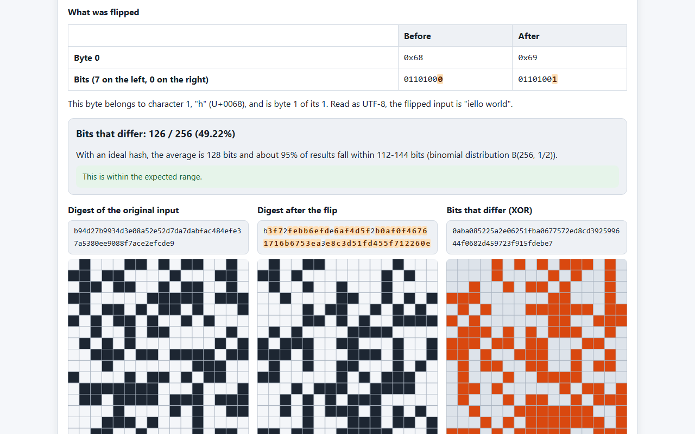
>
>*The Avalanche tab (SHA-256, bit 0 of byte 0 of hello world flipped)*

>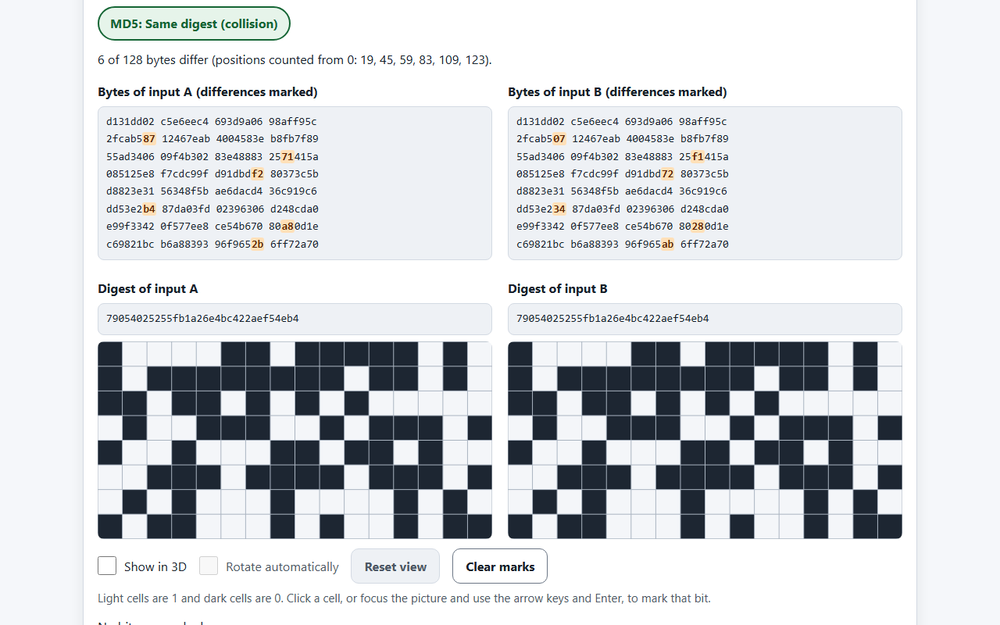
>
>*The Collisions tab (the MD5 collision pair of Wang et al., 2004)*

>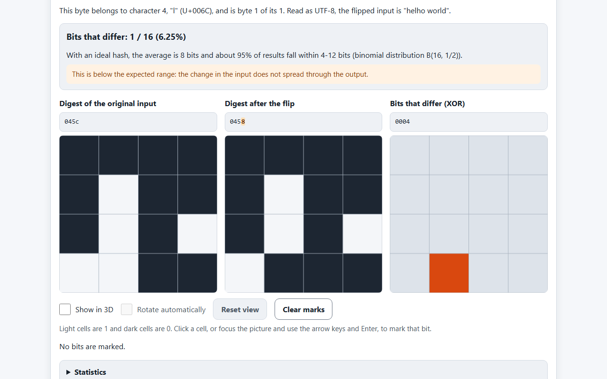
>
>*With the weak hash ToyHash16, fewer bits change than the expected range*

>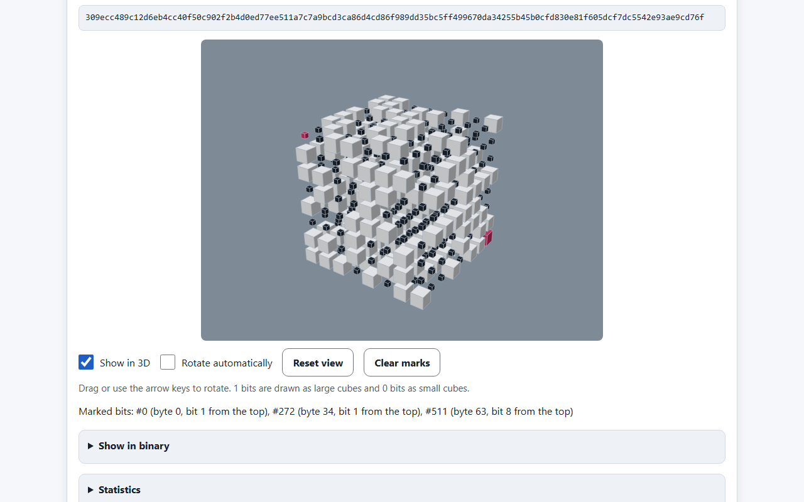
>
>*The Visualize tab (SHA-512 in 3D, with marked bits)*

>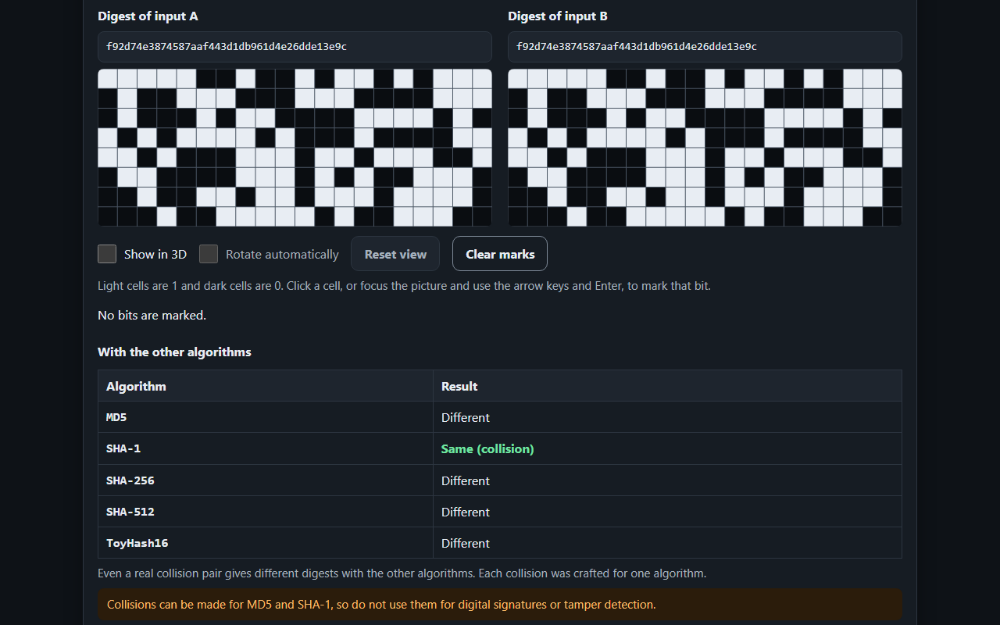
>
>*The first 320 bytes of SHAttered collide only under SHA-1 (dark mode)*

>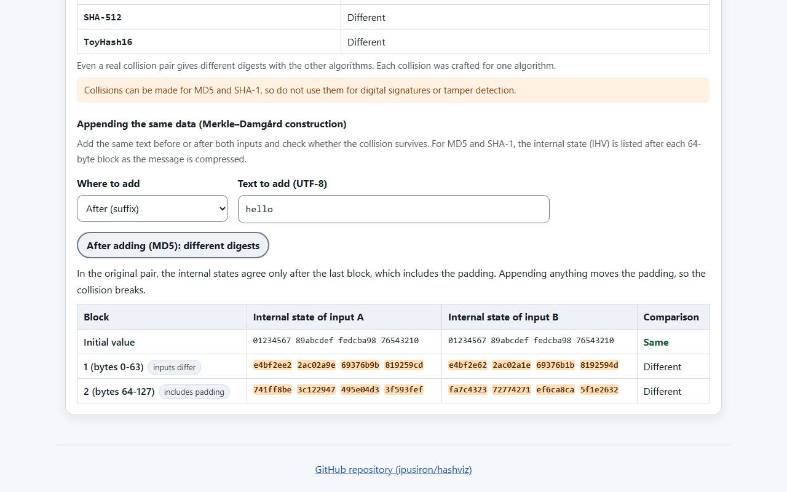
>
>*Appending hello breaks the 72-character pair (internal state after each block)*

>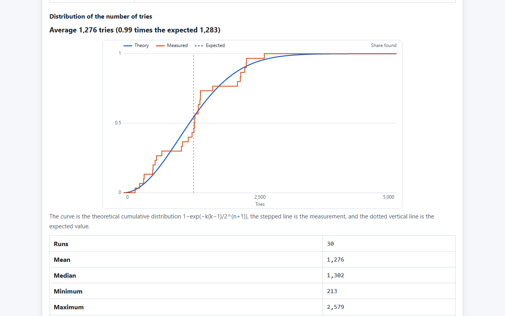
>
>*The Birthday attack tab (first 20 bits of SHA-256, 30 runs; the cumulative distribution of tries against the theory)*

>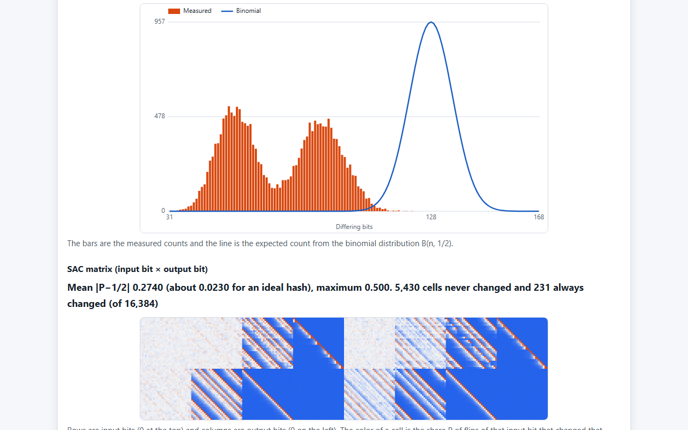
>
>*Diffusion (SHA-256 reduced to 4 rounds: the distribution departs from the binomial and the SAC matrix stays biased)*

>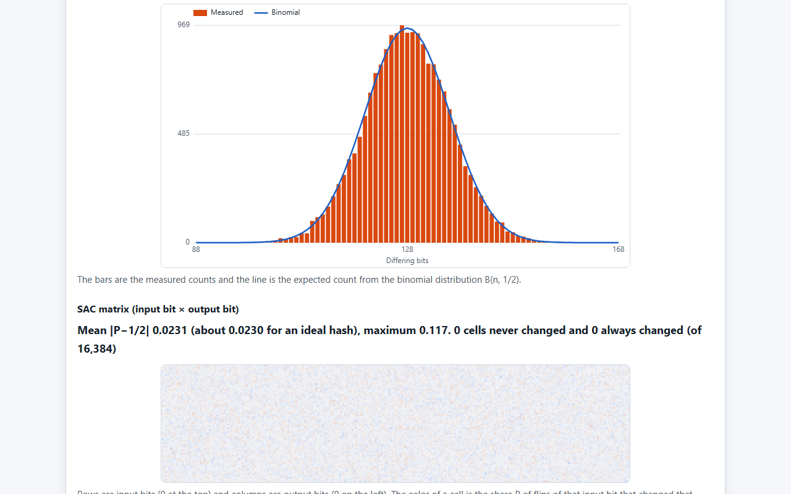
>
>*Diffusion (standard SHA-256: the distribution matches the binomial and the SAC matrix is nearly uniform)*

>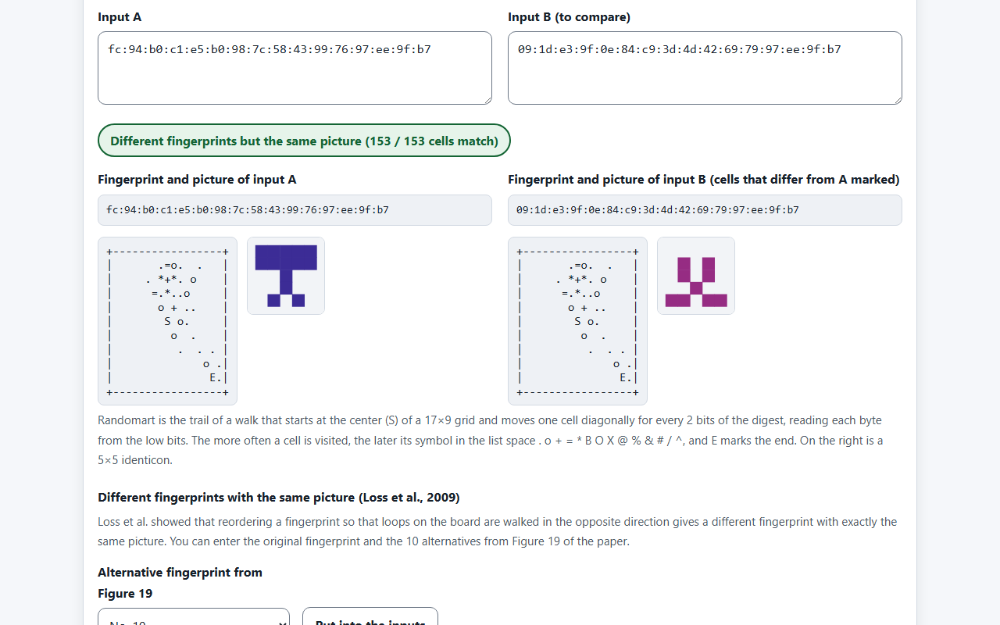
>
>*Fingerprint art (Figure 19 of Loss et al.: different fingerprints, the same picture)*

>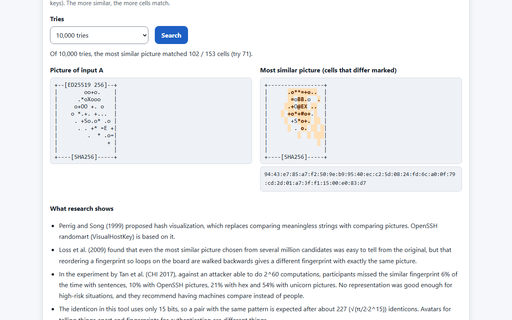
>
>*Fingerprint art (the picture of a test SSH public key and the most similar picture found among random digests)*

---

## ✨ Features

### Avalanche

- Flips one chosen bit of one chosen byte of the input (text, hex or Base64) and shows the digests of the original and the flipped input side by side
- Shows the flipped byte before and after (in hex and binary, with the flipped bit marked) and, for text, which character the byte belongs to and which of its bytes it is
- Marks the hex digits that differ between the two digests and draws the differing bits (XOR) as a third picture
- Compares the number and share of differing bits with the range expected from an ideal hash (about 95% of the binomial distribution B(n, 1/2))
- Moves the flipped position with "Previous bit", "Next bit" and "Random position"
- Explains out-of-range positions and unreadable input instead of rounding them

### Diffusion

- Flips each of the 64 bits of 100-1,000 random 8-byte inputs in turn and counts how the output changes
- Overlays the histogram of differing bits with the expected counts of the binomial distribution (statistical avalanche)
- Draws the share of changes for each input bit × output bit as a heat map (SAC matrix)
- Algorithms: MD5, SHA-1, SHA-256, SHA-512, ToyHash16, and SHA-256 with a chosen number of rounds (1-64)

### Visualization

- Shows the digest in hex and binary, and lays its bits out on a grid from the most significant bit
- Marks a bit when you click its cell or use the keyboard (arrow keys and Enter). Marked bits are also listed in text, with their byte and position from the top
- Shows statistics (number of 1s, balance of 0s and 1s, runs of the same bit and so on) in a table

### Collisions

- Contains seven real collision pairs (four for MD5, one for SHA-1, two for ToyHash16), each with its sources
- Marks the bytes that differ between the two inputs and shows how many of them differ
- Tells whether the chosen algorithm gives the same digest (a collision), and lists the result for every other algorithm in a table
- The inputs are editable, so you can check that changing even one character breaks the collision
- Adds the same text before or after both inputs and tells whether the collision survives. For MD5 and SHA-1, lists the internal state (IHV) of A and B after each 64-byte block, marking the words that differ, the blocks where the inputs differ and the blocks that include padding

### Birthday attack

- Compares only the first n bits (8-36) of the digest (MD5, SHA-1, SHA-256, SHA-512), hashing messages of the form "random seed-number" in turn until two give the same value
- Compares the number of tries in 1-100 runs with the expected value √(π/2·2^n), and draws their cumulative distribution over the theoretical curve
- Shows the pair found (the two messages and their digests, with the matching first n bits marked). The Stop button stops the search
- Lists the birthday bound for the whole digest of each algorithm and the cost of the known collision attacks

### Fingerprint art

- Draws the same fingerprint line and randomart as ssh-keygen -lv from an SSH public key line (ED25519, RSA, ECDSA; SHA256, MD5)
- Also draws from a fingerprint itself (hex, SHA256:...) or from the hash of text, hex or Base64, next to a 5×5 identicon
- Compares two inputs, telling whether the fingerprints and the pictures are the same (the number of matching cells), and marks the cells that differ
- Enters the different fingerprints with the same picture from Figure 19 of Loss et al. (2009)
- Searches 1,000-100,000 random digests for the most similar picture

### Glossary

- 19 entries: hash function, digest, avalanche effect, collision, collision resistance, one-wayness, second-preimage resistance, birthday attack, Merkle–Damgård construction, MD5, SHA-1, SHA-2, SHA-3, Wang et al.'s attack, SHAttered, chosen-prefix collision, Flame, ToyHash16 and hash visualization

### Common

- Switches between a 2D grid and 3D cubes. In 3D, drag or use the arrow keys to rotate, or let it rotate automatically (it stops while the tab is hidden and when 3D is turned off)
- Algorithms: MD5, SHA-1, SHA-256, SHA-512 and ToyHash16
- Switches between Japanese and English, and between light and dark
- Recomputes as soon as the input changes

---

## 📖 How to use

### The Avalanche tab

1. Enter a string, then choose the input format and the algorithm
2. Enter the byte to flip (counted from 0) and the bit to flip (0 is the least significant bit, 7 the most significant)
3. Check in the table which bit of which character changed
4. Check whether the number of differing bits falls within the expected range. Move the position with "Next bit" and compare a few times
5. Switch the algorithm to ToyHash16 and see that hardly any bits change

### The Diffusion tab

1. Choose the algorithm and the number of random inputs, and press "Measure"
2. Check that the histogram matches the binomial line and that the SAC matrix is nearly the middle color
3. Switch to ToyHash16 or to 1, 2 and 4 rounds of "SHA-256 (choose the rounds)" and compare how the biases appear

### The Visualize tab

1. Enter a string and choose the algorithm
2. Change one character of the input and see the pattern turn into a completely different one
3. Mark the bits you are interested in. Choose "Show in 3D" to see them as cubes

### The Collisions tab

1. Choose a collision pair and press "Put into the inputs"
2. Check the verdict (same digest) and the positions of the differing bytes
3. Check in the "With the other algorithms" table that the other algorithms do not collide
4. Change one character of input B and see the collision break
5. Under "Appending the same data", choose where to add and what text. Check with the internal states that the 72-character pair breaks when text is appended and the 128-character pair survives

### The Birthday attack tab

1. Choose the algorithm, the number of bits n to compare and the number of runs (an estimate of the work is shown)
2. Press "Search". If it takes long, press "Stop"
3. Check that the average number of tries is close to the expected value, and far below 2^n
4. Check that adding 4 bits to n makes the number of tries about 4 times (2^(4/2)) larger

### The Fingerprint art tab

1. Choose "SSH public key" as the input type and paste a public key line (such as the contents of `~/.ssh/id_ed25519.pub`) into input A. Do not paste a private key
2. Check that the fingerprint line and the picture are the same as the output of `ssh-keygen -lv -f id_ed25519.pub`
3. Enter a fingerprint from Figure 19 with "Different fingerprints with the same picture" and check that different fingerprints give the same picture
4. Use "Searching for a similar picture" to find the most similar picture among random digests and see whether you can tell them apart

### The Glossary tab

- Read the terms for the properties of hash functions and the attacks covered by this tool

---

## 🌊 Avalanche effect

One important property of cryptographic hash functions is the avalanche effect: a small change in the input (for example a difference of a single bit) causes a large change throughout the output.

With an ideal hash, flipping one input bit flips each output bit with probability 1/2 (the Strict Avalanche Criterion, SAC). The number of bits that change then follows the binomial distribution B(n, 1/2). The average is half of the output, but a single try rarely lands exactly on 50%. **HashViz compares the number of changed bits with the central range of about 95% of this distribution.**

| Algorithm | Output bits | Mean | Standard deviation | About 95% |
|---|---|---|---|---|
| MD5 | 128 | 64 | 5.66 | 53-75 |
| SHA-1 | 160 | 80 | 6.32 | 68-92 |
| SHA-256 | 256 | 128 | 8.00 | 112-144 |
| SHA-512 | 512 | 256 | 11.31 | 234-278 |
| ToyHash16 | 16 | 8 | 2.00 | 4-12 |

- The lower end is the smallest value whose probability of being at or below it exceeds 2.5%, and the upper end is its mirror image
- Even an ideal hash falls outside the range about once in 20 tries. One miss does not mean the hash is weak

Flipping bit 0 of byte 0 of `hello world` (`h`, 0x68) gives `iello world`. The number of bits that change is as follows.

| Algorithm | Digest of the original input | Changed bits |
|---|---|---|
| MD5 | `5eb63bbbe01eeed093cb22bb8f5acdc3` | 67 / 128 |
| SHA-1 | `2aae6c35c94fcfb415dbe95f408b9ce91ee846ed` | 88 / 160 |
| SHA-256 | `b94d27b9934d3e08a52e52d7da7dabfac484efe37a5380ee9088f7ace2efcde9` | 126 / 256 |
| ToyHash16 | `045c` | 1 / 16 |

---

## 🌀 Diffusion

In a single avalanche, the number of changed bits may fall inside the range or outside it by chance. The Diffusion tab flips each of the 64 bits of random 8-byte inputs in turn and counts over many pairs.

- Overlays the histogram of differing bits with the expected counts of the binomial distribution B(n, 1/2) (statistical avalanche)
- Draws the share P(i, j) of flips of input bit i that changed output bit j as a 64×n heat map (SAC matrix). For an ideal hash every cell is close to 1/2, and with T inputs the mean deviation of P from 1/2 is about 0.399/√T

The results of measuring 100 inputs (6,400 pairs) with a random generator fixed to seed 7 (`test/readme.test.js` computes the same values to check them):

| Algorithm | Mean differing bits | Share within the 95% range | Mean deviation of P from 1/2 | Cells that never changed |
|---|---|---|---|---|
| MD5 | 64.06 | 96.2% | 0.0403 | 0 / 8,192 |
| SHA-1 | 80.13 | 94.9% | 0.0393 | 0 / 10,240 |
| SHA-256 | 128.10 | 96.3% | 0.0398 | 0 / 16,384 |
| SHA-512 | 256.04 | 95.3% | 0.0396 | 0 / 32,768 |
| ToyHash16 | 2.00 | 14.0% | 0.4403 | 615 / 1,024 |
| SHA-256 (1 round) | 2.02 | 0.0% | 0.4971 | 15,950 / 16,384 |
| SHA-256 (2 rounds) | 14.50 | 0.0% | 0.4688 | 13,677 / 16,384 |
| SHA-256 (4 rounds) | 71.83 | 0.2% | 0.2787 | 5,653 / 16,384 |
| SHA-256 (8 rounds) | 128.03 | 96.5% | 0.0396 | 0 / 16,384 |

- With 100 inputs the reference value is 0.399/√100 ≈ 0.0399. MD5, SHA-1 and SHA-2 are close to it, with no cell that never changed
- ToyHash16 is a sum, so flipping one input bit only adds or subtracts a power of two, and the change reaches only the few bits the carry or borrow touches
- With fewer SHA-256 rounds, at 1-4 rounds the input bits reach only part of the output, leaving stripes and blue areas in the matrix. With the way this page measures (the 8-byte input goes into the first two words of the message), the statistics get close to the ideal at 8 rounds

**Statistics close to the ideal do not mean resistance to attacks.** The remaining rounds are also a margin against attacks that statistics cannot see (such as differential attacks).

---

## 💥 Collision pairs

The pairs in the Collisions tab are the data from the papers and their distributors as they are. Each pair gives the same digest only under its target algorithm and different digests under the others (checked in `test/core.test.js`).

| Pair | Algorithm | Length | Differing bytes | Shared digest | Source |
|---|---|---|---|---|---|
| Wang et al.'s collision | MD5 | 128 bytes | 6 | `79054025255fb1a26e4bc422aef54eb4` | Wang, Feng, Lai, Yu (2004), IACR ePrint 2004/199 |
| Single-block collision | MD5 | 64 bytes | 2 | `008ee33a9d58b51cfeb425b0959121c9` | Stevens (2012), IACR ePrint 2012/040 |
| Two printable strings (72 characters) | MD5 | 72 bytes | 1 | `faad49866e9498fc1719f5289e7a0269` | Project HashClash (Stevens, MIT License), corkami/collisions |
| Two printable strings (128 characters) | MD5 | 128 bytes | 1 | `3e11950f78f3e4da98630fb102307c70` | corkami/collisions (copyright-free example), Project HashClash |
| First 320 bytes of SHAttered | SHA-1 | 320 bytes | 62 | `f92d74e3874587aaf443d1db961d4e26dde13e9c` | Stevens et al. (2017), IACR ePrint 2017/190 |
| "AB" and 0x83 | ToyHash16 | 2 bytes and 1 byte | 2 | `0083` | Example of this tool |
| "ABC" and 0xC6 | ToyHash16 | 3 bytes and 1 byte | 3 | `00c6` | Example of this tool |

- Wang et al.'s pair collides in two blocks (128 bytes) from the standard MD5 initial value. It took about an hour back then; improvements in 2006 brought it to about a minute on an ordinary PC, and today a pair of this kind takes seconds
- Xie and Feng gave the first single-block example in 2010, and Stevens found this one in 2012 with a different method (about 2^49.8 MD5 compressions)
- Both pairs of printable strings (72 and 128 characters) differ only in the 22nd character, `A` and `E`. The 72-character pair collides only with the final padding included, so appending the same text to both breaks it. The 128-character pair has equal internal states after the second block, so appending keeps the collision
- SHAttered is the first SHA-1 collision, announced by Google and CWI in 2017. It took about 2^63 SHA-1 computations (about 9.2 quintillion): 6,500 CPU years and 110 GPU years. The two PDFs are identical for the first 192 bytes, and 62 bytes differ within the next 128. Appending the same content after the first 320 bytes keeps the collision

MD5 and SHA-1 use the Merkle–Damgård construction, which updates an internal state one block at a time. If two inputs have the same length and their internal states agree at a block boundary, appending the same data to both keeps the collision. **Collisions can be made for MD5 and SHA-1, so do not use them for digital signatures or tamper detection.**

### Appending the same data

The results of adding `hello` after or before both inputs with "Appending the same data" in the Collisions tab:

| Pair | Block where the internal states agree | Appended after | Added before |
|---|---|---|---|
| Wang et al.'s collision | 2 | Survives | Breaks |
| Single-block collision | 1 | Survives | Breaks |
| Two printable strings (72 characters) | 2 (the last block, with padding) | Breaks | Breaks |
| Two printable strings (128 characters) | 2 | Survives | Breaks |
| First 320 bytes of SHAttered | 5 | Survives | Breaks |
| "AB" and 0x83 | none (a sum) | Survives | Survives |
| "ABC" and 0xC6 | none (a sum) | Survives | Survives |

- Only pairs whose internal states agree at a block boundary inside the message, with identical messages after it, survive appending. The 72-character pair agrees only after the last block, which includes the padding, so appending moves the padding and breaks it
- Adding data before the inputs starts the compression from a different internal state than the one the pair was made for, so it breaks. Data that should come first has to be included when the pair is computed
- ToyHash16 is a sum of bytes, so adding the same bytes before or after both inputs increases both values by the same amount, and the collision survives

---

## 🎂 Birthday attack

Finding a collision of an n-bit hash does not take 2^n computations. When different inputs are hashed one after another, the chance that a new value matches one seen before grows with the square of the number of tries (the birthday paradox). The expected number of tries until the first collision is about √(π/2·2^n). **The Birthday attack tab measures this number by comparing only the first n bits of the digest.**

| Bits compared | Hex digits | Expected tries until the first collision | 2^n |
|---|---|---|---|
| 8 | 2 | 20 | 256 |
| 16 | 4 | 321 | 65,536 |
| 24 | 6 | 5,134 | 16,777,216 |
| 32 | 8 | 82,137 | 4,294,967,296 |
| 36 | 9 | 328,549 | 68,719,476,736 |

- The probability of having found a collision within k tries is approximately 1−exp(−k(k−1)/2^(n+1)). The chart draws this curve over the measurement
- The messages are "random seed-number" (for example `3fa9c2e10-0`), with a new seed for each run. The same seed gives the same result

The birthday bound for the whole digest of each algorithm, and the cost of the known collision attacks:

| Algorithm | Bits | Birthday attack | Known collision attack |
|---|---|---|---|
| MD5 | 128 | about 2^64 | about 2^16 (identical-prefix collision, compression-function calls) |
| SHA-1 | 160 | about 2^80 | about 2^63.1 (SHAttered) |
| SHA-256 | 256 | about 2^128 | none found |
| SHA-512 | 512 | about 2^256 | none found |

- When a way to make collisions with fewer computations than the birthday attack is found, the hash is said to be "broken". The MD5 and SHA-1 figures are from the 2017 paper by Stevens et al. (IACR ePrint 2017/190)

---

## 🖼️ Fingerprint art

The Fingerprint art tab tries hash visualization: turning digests into pictures that people can compare more easily. It draws the same pictures as OpenSSH randomart (VisualHostKey, `ssh-keygen -lv`), which is based on the proposal by Perrig and Song (1999).

- How it is drawn (the same as fingerprint_randomart in OpenSSH sshkey.c): starting from the center of a 17×9 grid, each byte of the digest is read 2 bits at a time from the low bits, and the walk moves one cell diagonally: right if the first bit is 1 and left if 0, down if the second bit is 1 and up if 0. A move into a wall is ignored in that direction. The number of visits selects a symbol in the order space . o + = * B O X @ % & # / ^, with S at the start and E at the end
- From an SSH public key line (ssh-ed25519, ssh-rsa, ecdsa-sha2-nistp256/384/521), the same fingerprint line and picture as ssh-keygen -lv are produced. Tests check that they match the output of OpenSSH 8.2p1 character for character for three test keys (ED25519, RSA, ECDSA) with SHA256 and MD5
- The 5×5 identicon is this tool's own design (the top 15 bits of the digest set the left three columns, which are mirrored, and the hue comes from bytes 3 and 4)

**Different pictures mean different keys, but pictures that look the same do not guarantee the same key.** Loss et al. (2009) showed that reordering a fingerprint so that loops on the board are walked backwards gives a different fingerprint with exactly the same picture. The 11 fingerprints in Figure 19 of the paper (the first is the original) all give the same picture (you can enter them with "Different fingerprints with the same picture" in the tab).

```text
fc:94:b0:c1:e5:b0:98:7c:58:43:99:76:97:ee:9f:b7
09:1d:0f:da:c8:fd:e9:40:53:42:99:76:97:ee:9f:b7
09:1d:27:da:83:dc:fe:94:d0:40:99:76:97:ee:9f:b7
09:1d:8f:c8:3d:fe:94:80:75:42:99:76:97:ee:9f:b7
09:1d:9a:dc:3c:fe:94:50:0e:43:69:79:97:ee:9f:b7
09:1d:a7:9f:0e:34:8c:9c:f5:40:69:79:97:ee:9f:b7
09:1d:ca:d9:3c:fe:94:50:0e:43:69:79:97:ee:9f:b7
09:1d:ca:d9:3c:fe:94:50:0e:43:99:76:97:ee:9f:b7
09:1d:da:9f:0e:84:dc:13:e7:40:99:76:97:ee:9f:b7
09:1d:e3:9f:0e:84:9c:3d:4d:42:69:79:97:ee:9f:b7
09:1d:e3:9f:0e:84:c9:3d:4d:42:69:79:97:ee:9f:b7
```

```text
+-----------------+
|       .=o.  .   |
|     . *+*. o    |
|      =.*..o     |
|       o + ..    |
|        S o.     |
|         o  .    |
|          .  . . |
|              o .|
|               E.|
+-----------------+
```

The share of participants who missed a similar fingerprint (Tan et al., CHI 2017; similar fingerprints made by an attacker able to do 2^60 computations, shown side by side for confirmation):

| Representation | Participants who missed the attack |
|---|---|
| Sentences | 6% |
| OpenSSH pictures (Visual Host Key) | 10% |
| Vash (abstract art) | 12% |
| Words | 14% |
| Alternating vowels and consonants | 17% |
| Hex | 21% |
| Numbers | 35% |
| Unicorn pictures | 54% |

- No representation was good enough for high-risk situations, and Tan et al. recommend having machines compare instead of people
- Loss et al. report that even the most similar picture chosen from several million candidates was easy to tell from the original. "Searching for a similar picture" in the tab tries this on a small scale with random digests
- The identicon in this tool uses only 15 bits, so a pair with the same pattern is expected after about 227 (√(π/2·2^15)) identicons. Avatars for telling things apart and fingerprints for authentication are different things

---

## 🔍 How the visualization works

1. Turn the input into bytes (UTF-8 for text) and compute the digest with the chosen algorithm
2. Split each byte of the digest into 8 bits from the most significant bit, giving a sequence of n bits (bit number i is bit (i mod 8) + 1 from the top of byte i ÷ 8)
3. Lay the bits out left to right, then on to the next row. 1 is painted as a light cell and 0 as a dark cell
4. In 3D, fill one layer in the same order, then move on to the next layer back. 1 is drawn as a large cube and 0 as a small cube, so you can see inside

| Algorithm | Bits | 2D grid (columns × rows) | 3D cubes (columns × rows × layers) |
|---|---|---|---|
| MD5 | 128 | 16×8 | 8×4×4 |
| SHA-1 | 160 | 20×8 | 8×5×4 |
| SHA-256 | 256 | 16×16 | 8×8×4 |
| SHA-512 | 512 | 32×16 | 8×8×8 |
| ToyHash16 | 16 | 4×4 | 4×2×2 |

- The 3D picture places the sequence of bits in space; it does not represent the internal structure of the hash function
- The 3D picture is drawn directly on a Canvas by painting the cubes from back to front (the painter's algorithm)

---

## 🎮 ToyHash16

ToyHash16 is a weak hash made for teaching in this tool. It returns the sum of the input bytes modulo 65536 as a two-byte hash value (high byte, low byte).

$$\text{ToyHash16}(m) = \left( \sum_{i=0}^{|m|-1} m_i \right) \bmod 2^{16}$$

- $m$ is the input bytes, $m_i$ the byte at position $i$ (0-255) and $|m|$ the length of the input

Unlike a real cryptographic hash function it is very weak by design, but that makes it a handy way to see collisions.

- Input A `"AB"` (hex `41 42`) is 0x41 + 0x42 = 131, so `0x0083`
- Input B `"\x83"` (hex `83`) is 131, so `0x0083`

Both give the hash value `0x0083`: a collision. The order of the bytes does not change the sum, so even reordering them gives a collision.

With ToyHash16, flipping one input bit changes the sum by a single power of two, so only one output bit, or a few more for the carry, change. Flipping bit 2 of byte 3 of `hello world` turns the digest from `045c` into `0458`: only 1 of the 16 bits changes, far below the expected range (4-12 bits).

### How to check

1. In the Collisions tab, choose "ToyHash16: "AB" and 0x83" as the collision pair and press "Put into the inputs"
2. Check that the verdict is "Same digest (collision)"
3. In the Avalanche tab, switch the algorithm to ToyHash16 and compare with SHA-256

---

## 🎓 Learning path

This tool is designed so that you can learn about cryptographic hash functions step by step. Following the steps below takes you from the basics to the applications.

### Step 1: Observe hash values

- Enter any string and hash it with SHA-256 or another algorithm
- Look at the hex digest and the pattern of the grid
- Goal: get an intuitive sense that a hash value is a "fingerprint" of the input

### Step 2: Experience the avalanche effect

- Flip only one bit of the input and compute the hash again
- Compare the number of changed bits with the expected range (the binomial distribution)
- In the Diffusion tab, check that the distribution over many inputs matches the binomial distribution
- Goal: experience the unpredictability and strong diffusion of hash functions

### Step 3: Compare with a weak hash (ToyHash16)

- Do the same with ToyHash16 and see that hardly any bits change
- In the Diffusion tab, look at the biases in the SAC matrices of ToyHash16 and of SHA-256 with reduced rounds
- Check the known collision pair (`"AB"` and `"\x83"`)
- Goal: understand the properties a good hash needs by contrast with a weak one

### Step 4: Real-world collisions (MD5 / SHA-1)

- Compute real collision pairs found by researchers
- Check that the same pairs do not collide under SHA-256
- Compare, with the internal state after each block, pairs that survive appending the same text and pairs that break
- Goal: learn that algorithms once thought secure were broken, and that cryptographic algorithms have a lifetime

### Step 5: Measure how easily collisions are found with a birthday attack

- Search for collisions in the first n bits and check that it takes about √(π/2·2^n) tries
- From how the count grows with n, estimate why a brute-force collision search on a 128-bit or 256-bit hash is not realistic
- Goal: understand with numbers that collisions always exist but cannot be found for a secure hash

### Step 6: Compare fingerprints as pictures

- Draw the fingerprint and picture of your own SSH public key in the same form as ssh-keygen
- Look at different fingerprints with the same picture (Loss et al., Figure 19) and see that the same picture does not guarantee the same key
- Goal: learn the strengths and limits of comparing by eye

### Step 7: Moving to modern hashes

- Use SHA-256 and SHA-512, and read in the glossary how the treatment of SHA-1 changed (CAs stopping issuance, browsers distrusting it, NIST's plan)
- Goal: convince yourself why strong algorithms must be chosen

---

## 🎯 Use cases

### Classes and self-study

- In a university or vocational school class, students enter their own names and check whether the number of bits changed by a one-bit flip falls within the expected range. Putting SHA-256 and ToyHash16 side by side starts a discussion of what makes a good hash
- When studying for security certifications, learners check the differences between one-wayness, second-preimage resistance and collision resistance with the glossary and the Collisions tab. Reading what "collision resistance is broken" means after seeing a real pair sticks better than memorizing the words
- A teacher projects the Wang et al. or SHAttered pair and demonstrates in class that the digests are the same while the data differ
- In a probability or statistics class, try the birthday paradox dozens of times with hashes instead of the birthdays in the classroom, and compare the measured distribution with the theoretical curve
- In a cryptography class, show with the SAC matrices of SHA-256 at 1, 2, 4 and 8 rounds how diffusion spreads as rounds are stacked. It also helps explain that good statistics and security are different things

### Work

- When reviewing an existing system that checks file identity with MD5, a developer uses the Collisions tab in the explanation. It shows that where an attacker can prepare the files, the same MD5 does not mean the same file
- When explaining why internal rules forbid SHA-1 signatures and certificates, IT and audit staff show that the 320 bytes of SHAttered really collide
- A developer who uses the first few characters of a hash as an identifier (a shortened commit hash, the first 8 characters in a file name or ID, and so on) estimates how many items it takes before a collision is likely. One hex digit is 4 bits, so 8 digits mean the first 32 bits, and about 80,000 items is the rough figure
- Server administrators and developers check the fingerprint and picture of their own SSH public keys in the same form as ssh-keygen, and use them to explain the team's key-checking procedure (comparing the fingerprint strings). Different fingerprints with the same picture show why the picture alone is not enough
- Storage and backup staff check that the premise of deduplication by hash (that collisions do not happen) can be broken by an attacker for MD5 and SHA-1

### Everyday life

- Check what the "SHA-256" value on a software download page means by seeing that changing one character gives a completely different value (this tool cannot read files, so compute the hash of a file with an OS command or similar)
- Show the pattern changing when explaining the idea of a "fingerprint of data" to family or friends

### Hobbies and creative work

- As a puzzle, look for ToyHash16 collisions by hand. Only the sum of the bytes matters, so collisions can be made by reordering or by adding
- Use the grid of a digest as the basis of pixel art, embroidery or bead patterns. Changing the input gives another pattern
- Use identicons and randomart as designs for creative work such as account icons or greeting-card decorations (the pattern changes with every input)
- Use the automatic 3D rotation as a display at a study group or an event booth

### Research

- Paste the hex of a collision pair from a paper as it is and check in the browser whether it really collides
- Check the condition behind the statement in exercises such as SEED Labs that "appending the same data to a collision pair keeps the collision", side by side with a pair where it does not hold (the 72-character pair)
- Collect avalanche results at several positions and record how many fall within the binomial range

### CTF

- Before solving a "same MD5, different content" challenge, check the properties of collision pairs (same length, positions of the differing bytes, what happens when something is appended)
- Challenge authors make collision problems that can be solved by hand with ToyHash16

### Combining with other tools

- Estimate the algorithm from the length of a hash value with [Hash Identifier](https://ipusiron.github.io/hash-detector/), then make a digest of the same length in HashViz and compare
- Read the chapter on hash functions in the related books (under "References") and check the properties one by one on screen

---

## 🔬 Technical notes

### Computing hashes

- MD5: RFC 1321 is implemented in this tool (`js/hashviz-core.js`). It can also return the internal state after each block. It is tested against the test suite in Appendix A.5 of RFC 1321 and against Node.js `crypto`
- SHA-1, SHA-256, SHA-512: computed with the browser's Web Crypto (`crypto.subtle.digest`)
- ToyHash16: returns the sum of the bytes modulo 65536 as two bytes

### Input formats

- Text: the UTF-8 bytes (one Japanese character is three bytes)
- Hex: spaces and line breaks are ignored, and one leading `0x` is removed. Odd numbers of digits and non-hex characters are explained
- Base64: accepts the standard (`+` `/`) and URL-safe (`-` `_`) alphabets; the trailing `=` may be omitted
- The limit is 400,000 bytes per input (the Avalanche and Visualize inputs take up to 10,000 characters, the Collisions inputs up to 100,000)

### What the statistics mean

- The statistics table (number of 1s, balance of 0s and 1s [entropy], runs of the same bit, distinct byte values) counts the 0s and 1s within one digest. It does not measure the strength of the hash

### Diffusion

- To choose the number of rounds, SHA-256 is also implemented in this tool from FIPS 180-4 (tests check that 64 rounds give the same values as Web Crypto). The output of the reduced version is the initial value plus the state after r rounds
- Input bit i is bit (i mod 8) + 1 from the top of byte i ÷ 8 of the 8 bytes. Each input is hashed 65 times (the original and the 64 flips)
- The random numbers come from `crypto.getRandomValues` on the page and from a seeded generator (mulberry32) in the tests

### Fingerprint art

- Randomart is drawn with the same steps as fingerprint_randomart in OpenSSH sshkey.c. The ssh-keygen -lv output of OpenSSH 8.2p1 for three test keys × SHA256 and MD5 is embedded in `test/core.test.js`, which checks that the output matches character for character (the private keys of the test keys were deleted right after they were made)
- An SSH public key is read by decoding the second field of the line as Base64 and checking that the key type inside matches the start of the line. The size of an RSA key is the bit length of n, and that of an ECDSA key comes from the curve name
- "Matching cells" in the similar-picture search counts the cells with the same symbol (including blank cells), so even two unrelated pictures match about 100 cells

### Internal states and the birthday attack

- To show the internal states, SHA-1 is also implemented in this tool from FIPS 180-4 (the digest itself is still computed with Web Crypto). For both MD5 and SHA-1, the state after each block of the padded message is shown in the same byte order as the digest
- The birthday search hashes 1,024 messages at a time and gives control back to the page every 30 milliseconds (so the Stop button works). The values seen are kept as numbers in a `Map`, so n is limited to 36 bits

### Drawing

- Both the 2D grid and the 3D cubes are drawn on a Canvas. The picture follows the width of the page and is drawn at `devicePixelRatio` times on high-resolution screens
- The automatic 3D rotation runs only when 3D is on, rotation is requested, the tab is visible and the page is visible

---

## 🔒 Security

- The input is not sent anywhere. The meta CSP sets `connect-src 'none'`, and no external scripts (CDN) are loaded
- Scripts and styles come only from the same origin (`script-src 'self'`, `style-src 'self'`). The HTML has no inline scripts, style attributes or event handlers
- Dynamic parts of the page are built with `textContent` and elements (no `innerHTML`)
- `localStorage` stores only the chosen language and theme. The page works where it is not available
- Only public keys go into the Fingerprint art tab. Anything not in the form of a public key line is not read (do not paste private keys)

---

## ⚠️ Notes and limitations

- This tool cannot read files. Paste text, hex or Base64 into the inputs
- SHA-3, BLAKE2 and others are not covered (the browser's Web Crypto cannot compute them)
- The Birthday attack tab searches for collisions in the first n bits (up to 36) of the digest; it does not make collisions of the whole digest. The speed depends on the browser and the device
- The Diffusion tab measures only 8-byte inputs. With other input lengths or placements, the results for reduced rounds also change
- Fingerprint art does not check whether a server's key is genuine. To check a key, compare the fingerprint string with a value obtained through a trusted channel
- The Collisions tab computes pairs found by researchers to check them; it cannot make new collisions
- The expected range (about 95%) is a statistical guide. A single try outside it does not mean the hash is weak
- The 3D picture places the sequence of bits in space; it does not represent the internal structure of the hash function
- This tool is meant for learning and teaching cryptography. The author does not encourage uses that harm others

---

## 📝 Development notes

### The error in Claude Code

While implementing the "collision demo" tab, I asked Claude Code to "finish the hash collision tab, and add samples to the data folder if there are not enough". The following error occurred.

```
API Error: Claude's response exceeded the 32000 output token maximum.
To configure this behavior, set the CLAUDE_CODE_MAX_OUTPUT_TOKENS environment variable.
```

This error means that Claude Code's output exceeded the limit of 32,000 tokens. The cause was trying to expand the collision files as they are (each SHAttered PDF is about 422 KB).

### Lessons

- Asking Claude Code to generate large data directly can bloat the output beyond the limit
- Keep only the part of large data you need. A collision holds within the first tens to hundreds of bytes (64-128 bytes for MD5, 320 bytes for SHA-1), so HashViz keeps only that part in its computation module
- Requests to implement something work better when split into small steps

Based on this, the tool was built step by step: first the ToyHash16 collision demo, then the real MD5 and SHA-1 examples.

---

## 🧪 Tests

```bash
npm test
```

- Runs with `node --test` on Node.js 22 or later, with no dependencies (no `npm install` needed)
- Runs on GitHub Actions for every push and pull request
- `test/core.test.js`: MD5 (the RFC 1321 test suite, and inputs with bytes 0x80 and above compared with Node.js `crypto`), the SHA family, ToyHash16, the collision pairs (they collide only under their target algorithm; positions of the differing bytes), input parsing, one-bit flips, the binomial range (compared with an exact BigInt computation), statistics, the grid and 3D layout and projection, SHA-1 (the FIPS 180 examples and Node.js `crypto`), the internal states after each block and the results of appending or prepending (compared with Node.js `crypto`), and the birthday search (the pair found matches only in the first n bits, n=8 finishes within 257 tries, the mean of 200 runs at n=12 is within ±10% of the expected value)
- `test/core.test.js` (continued): SHA-256 with reduced rounds (64 rounds match Node.js `crypto`) and the diffusion measurement (with a seeded generator, SHA-256, MD5 and SHA-1 are close to the reference while ToyHash16 and 1-4-round SHA-256 are biased)
- `test/core.test.js` (continued): randomart (matches ssh-keygen -lv character for character; the 11 fingerprints of Figure 19 give the same picture), reading SSH public keys, the similar-picture search, the identicon
- `test/html.test.js`, `test/contrast.test.js`, `test/messages.test.js`, `test/i18n.test.js`, `test/format.test.js`: CSP, no external scripts, tab ARIA, dictionaries and page text, color contrast (4.5:1 and 3:1), formatting
- `test/readme.test.js`: compares the README tables (expected ranges, examples, collision pairs, appending, birthday attack, diffusion, Figure 19 fingerprints and picture, grid shapes) with the output of the computation module, and checks the headings, images and directory structure of both READMEs

---

## 🔗 References

### Primary sources

- [R. Rivest, "RFC 1321: The MD5 Message-Digest Algorithm" (1992)](https://www.rfc-editor.org/rfc/rfc1321)
- [X. Wang, D. Feng, X. Lai, H. Yu, "Collisions for Hash Functions MD4, MD5, HAVAL-128 and RIPEMD" (IACR ePrint 2004/199)](https://eprint.iacr.org/2004/199)
- [M. Stevens, "Single-block collision attack on MD5" (IACR ePrint 2012/040)](https://eprint.iacr.org/2012/040)
- [M. Stevens, "MD5 single-block collision" (message1.bin and message2.bin)](https://marc-stevens.nl/research/md5-1block-collision/)
- [M. Stevens, E. Bursztein, P. Karpman, A. Albertini, Y. Markov, "The first collision for full SHA-1" (IACR ePrint 2017/190)](https://eprint.iacr.org/2017/190)
- [Google Security Blog, "Announcing the first SHA1 collision" (February 23, 2017)](https://security.googleblog.com/2017/02/announcing-first-sha1-collision.html)
- [G. Leurent, T. Peyrin, "SHA-1 is a Shambles" (IACR ePrint 2020/014)](https://eprint.iacr.org/2020/014)
- [Project HashClash (M. Stevens)](https://github.com/cr-marcstevens/hashclash)
- [corkami, "collisions" (A. Albertini)](https://github.com/corkami/collisions)
- [NIST, "NIST Retires SHA-1 Cryptographic Algorithm" (December 15, 2022)](https://www.nist.gov/news-events/news/2022/12/nist-retires-sha-1-cryptographic-algorithm)
- [NIST, "FIPS 202: SHA-3 Standard"](https://csrc.nist.gov/pubs/fips/202/final)
- [A. Perrig, D. Song, "Hash Visualization: a New Technique to improve Real-World Security" (1999)](https://users.ece.cmu.edu/~adrian/projects/validation/validation.pdf)
- [D. Loss, T. Limmer, A. von Gernler, "The drunken bishop: An analysis of the OpenSSH fingerprint visualization algorithm" (2009)](http://www.dirk-loss.de/sshvis/drunken_bishop.pdf)
- [J. Tan, L. Bauer, J. Bonneau, L. F. Cranor, J. Thomas, B. Ur, "Can Unicorns Help Users Compare Crypto Key Fingerprints?" (CHI 2017)](https://users.ece.cmu.edu/~lbauer/papers/2017/chi2017-fingerprints-author.pdf)
- [OpenSSH, "sshkey.c" (fingerprint_randomart)](https://github.com/openssh/openssh-portable/blob/master/sshkey.c)

### Related books (ones I worked on)

- [『暗号技術のすべて』](https://akademeia.info/?page_id=157) (Japanese-language book, Shoeisha), Chapter 5 "Hash functions"
- [『安全な暗号をどう実装するか 暗号技術の新設計思想』](https://book.mynavi.jp/ec/products/detail/id=147364) (Japanese-language book, Mynavi), Chapter 6 "Hash functions"

### Related tools (my own)

- [Token Entropy Estimator - a token strength checker based on entropy](https://ipusiron.github.io/token-entropy-estimator/)
- [Hash Identifier - a hash identification tool](https://ipusiron.github.io/hash-detector/)

---

## 📁 Directory structure

```text
hashviz/
├── .github/                 # GitHub settings
│   └── workflows/           # GitHub Actions workflows
│       └── test.yml         # Runs npm test on push and pull request
├── assets/                  # Images for the README
│   ├── en/                  # Screenshots of the English page
│   │   ├── screenshot.png   # The Avalanche tab (English)
│   │   ├── screenshot2.png  # Wang et al.'s collision pair (English)
│   │   ├── screenshot3.png  # Avalanche with ToyHash16 (English)
│   │   ├── screenshot4.png  # SHA-512 in 3D (English)
│   │   ├── screenshot5.png  # The SHAttered collision (English, dark)
│   │   ├── screenshot6.png  # Appending the same data (English)
│   │   ├── screenshot7.png  # The Birthday attack tab (English)
│   │   ├── screenshot8.png  # Diffusion of 4-round SHA-256 (English)
│   │   ├── screenshot9.png  # Diffusion of standard SHA-256 (English)
│   │   ├── screenshot10.png # Different fingerprints, same picture (English)
│   │   └── screenshot11.png # Searching for a similar picture (English)
│   ├── screenshot.png       # The Avalanche tab
│   ├── screenshot2.png      # Wang et al.'s collision pair
│   ├── screenshot3.png      # Avalanche with ToyHash16
│   ├── screenshot4.png      # SHA-512 in 3D
│   ├── screenshot5.png      # The SHAttered collision (dark)
│   ├── screenshot6.png      # Appending the same data
│   ├── screenshot7.png      # The Birthday attack tab
│   ├── screenshot8.png      # Diffusion of 4-round SHA-256
│   ├── screenshot9.png      # Diffusion of standard SHA-256
│   ├── screenshot10.png     # Different fingerprints, same picture
│   └── screenshot11.png     # Searching for a similar picture
├── js/                      # Scripts loaded by the page
│   ├── app.js               # Page logic (tabs, inputs, results)
│   ├── draw.js              # Drawing on the Canvas (2D grid, 3D cubes, charts, SAC matrix, identicon)
│   ├── hashviz-core.js      # Computation (MD5, SHA family, ToyHash16, collision pairs, internal states, birthday attack, diffusion, randomart, 3D layout)
│   ├── i18n.js              # Language choice and replacing the text in the HTML
│   ├── messages.js          # Japanese and English text
│   ├── theme-init.js        # Applies the saved theme before drawing
│   └── theme.js             # Switches between light and dark
├── test/                    # Automated tests (node --test)
│   ├── contrast.test.js     # Color contrast and the size of controls
│   ├── core.test.js         # The computation module
│   ├── format.test.js       # Line length, line breaks and control characters
│   ├── html.test.js         # CSP, tab ARIA, page text matching the dictionary
│   ├── i18n.test.js         # How the language is chosen
│   ├── load.js              # Loads the page's scripts into the tests
│   ├── messages.test.js     # The Japanese and English dictionaries
│   └── readme.test.js       # README tables, headings, images and directory structure
├── .gitignore               # Files Git ignores
├── .nojekyll                # Turns off Jekyll on GitHub Pages
├── CLAUDE.md                # Notes for development (for Claude Code)
├── LICENSE                  # MIT License
├── README.en.md             # This file
├── README.md                # The Japanese README
├── index.html               # The page
├── package.json             # Defines npm test (no dependencies)
└── style.css                # Styles (light and dark)
```

---

## 💻 Requirements

- A recent browser (tested on Chromium, Edge and Firefox; not tested on Safari)
- Opening `index.html` directly in the browser works. To use a local HTTP server instead:

```bash
python -m http.server 8000
# open http://localhost:8000/
```

---

## 📄 License

MIT License - see [LICENSE](LICENSE).

---

## 🛠️ About this tool

This tool was built as part of the "100 Security Tools with Generative AI" project.
The project builds and publishes a wide range of security tools over 100 days with the help of AI.

For details and the other tools, see:

🔗 [https://akademeia.info/?page_id=42163](https://akademeia.info/?page_id=42163)
