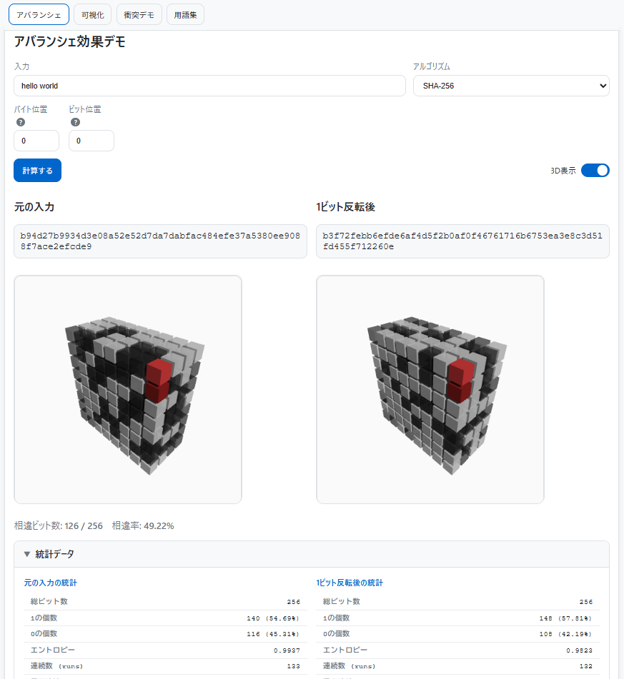

<!--
---
title: HashViz
category: cryptography
difficulty: 1
description: Educational hash explorer with bit-level visualization, avalanche effect demo, and historical collision samples.
tags: [hash, visualization, collision, avalanche, cryptography, education]
demo: https://ipusiron.github.io/hashviz/
---
-->

# HashViz - 教育用ハッシュ関数ビジュアルツール


[](https://ipusiron.github.io/hashviz/)

**Day056 - 生成AIで作るセキュリティツール100**

**HashViz**は、ビット単位の可視化、アバランシェ効果のデモ、実際の衝突例を体験できる教育用ハッシュ関数探索ツールです。
従来の教科書や資料では、ハッシュ関数の性質（わずかな入力差で大きく変化するアバランシェ効果や、異なる入力から同じ値が得られる衝突問題）は文字や数式で説明されることが多く、直感的に理解しづらい面があります。  

本ツールでは、入力文字列を実際にハッシュ化し、その出力をビットごとに可視化することで、視覚的に違いを体感できます。  
さらに、研究によって発見された実際のMD5やSHA-1の衝突例を試せるため、「ハッシュ関数が万能ではないこと」「安全性が時間とともに変化すること」を実感できます。  

暗号やセキュリティを学び始めた学生やエンジニアが、楽しみながら基礎概念を理解できることを目的としています。

---

## 🌐 デモページ

👉 **[https://ipusiron.github.io/hashviz/](https://ipusiron.github.io/hashviz/)**

ブラウザーで直接お試しいただけます。

---

## 📸 スクリーンショット

>
>
>*アバランシェ効果デモ*

---

## 🎯 機能

- **アバランシェ効果デモ**  
  入力の1ビットを変えるだけで、ハッシュ値が大きく変化することを体験できます。

- **ハッシュ値可視化**  
  ハッシュ値をビット単位で白黒のグリッド画像に変換し、直感的に比較できます。

- **衝突デモ**  
  歴史的な衝突攻撃の概念を学習できるサンプルを用意しています。  
  - MD5 Wang攻撃（教育用模擬例）- 実際の攻撃の背景を学習
  - MD5 Flame攻撃（教育用模擬例）- マルウェアでの悪用事例を理解  
  - SHA-1 SHAttered攻撃（教育用模擬例）- 大規模攻撃の概念を学習
  - **ToyHash16 実際の衝突例** - 簡易ハッシュで本物の衝突を体験

- **用語集**  
  ハッシュ関数と暗号学に関する重要な用語を分かりやすく解説。初学者の理解を支援します。

- **3D可視化**  
  ハッシュ値を立体的なキューブ構造で表現。2D/3D表示の切り替えが可能で、アバランシェ効果や衝突をより直感的に体験できます。

- **複数アルゴリズム対応**  
  MD5, SHA-1, SHA-256, SHA-512をサポート（Web Crypto APIおよび軽量ライブラリを利用）。

- **セキュリティ解説**  
  MD5やSHA-1が安全でない理由を明確に説明します。

---

## 🎯 想定ユーザー
- 暗号を学び始めた学生  
- セキュリティに興味を持つ一般ユーザー  
- 授業や教材で軽量なデモを必要とする教育者  

---

## 🌊 アバランシェ効果

暗号学的ハッシュ関数の重要な性質のひとつに **アバランシェ効果（Avalanche Effect）** があります。  
これは、入力のわずかな変化（たとえば1ビットだけの違い）が、出力全体に大きな変化をもたらす現象を指します。  

たとえば、SHA-256において、入力文字列の1文字を変更すると、計算されるハッシュ値のビットの約半数が異なるように変化します。  
この性質によって、ハッシュ関数は「予測が困難」「似た入力から出力を推測できない」といったセキュリティ上の強さを持ちます。  

HashVizでは、入力文字列の任意のビットを反転させ、**ハッシュ値の差分（相違ビット数や相違率）** を数値とビジュアルで確認できます。  
これにより、アバランシェ効果を直感的に理解できるようになります。

---

## 🖱️ ツールの使い方

### アバランシェ効果タブ
1. **入力欄**に任意の文字列を入力します。  
2. **バイト位置**を指定します。  
   - 入力文字列はUTF-8に変換され、バイト配列として扱われます。  
   - バイト位置は0から始まる番号で、何番目の文字を対象にするかを示します。  
   - 例：「hello」の場合  
     - 0番目 = `h` (0x68)  
     - 1番目 = `e` (0x65)  
3. **ビット位置**を指定します。  
   - 選択したバイトの中で、0〜7のどのビットを反転させるかを示します。  
   - 0が最下位ビット（LSB）、7が最上位ビット（MSB）です。  
   - 例：`0x65` = `01100101`  
     - ビット位置0 → 右端の `1` を反転  
     - ビット位置7 → 左端の `0` を反転  
4. **「計算する」ボタン**を押すと、  
   - 元の入力と1ビット反転後の入力でハッシュを計算し、両者を比較できます。  
   - 出力される内容は以下の通りです：  
     - ハッシュ値（16進表記）  
     - ビット単位の可視化（白黒グリッド）  
     - 相違ビット数と相違率（全体に対して何％違うか）  

---

### ハッシュ値可視化タブ
1. **入力欄**に文字列を入力します。  
2. **アルゴリズム**を選択します（SHA-1 / SHA-256 / SHA-512 / MD5）。  
   - MD5は軽量ライブラリを組み込んだ後に利用可能になります。  
3. **「ハッシュ化」ボタン**を押すと、  
   - 入力文字列のハッシュ値が16進表記で表示されます。  
   - ハッシュ値をビット列に展開し、白黒のグリッドとして可視化します。  
   - これにより、異なる入力がまったく異なる模様として表現され、比較が容易になります。  

---

### 衝突デモタブ
1. **サンプル選択**で衝突例を選びます。  
   - MD5/SHA-1は教育用模擬例（実際の衝突データは複雑すぎるため）
   - ToyHash16では実際の衝突を確認可能
   - サンプルは `data/collisions.json` に登録されています。  
2. **「サンプルを読み込む」ボタン**を押すと、入力Aと入力Bが自動的にセットされます。  
3. **「計算」ボタン**を押すと、  
   - 入力A/Bをハッシュ化し、両者の値が表示されます。  
   - ビット単位の可視化（グリッド）が並べて表示されます。  
   - ToyHash16では「衝突確認！同じハッシュ値 ✅」と表示されます。
   - MD5/SHA-1模擬例では「教育用模擬例」の説明が表示されます。

### 用語集タブ
1. **暗号学用語集**でハッシュ関数に関連する重要な概念を学習できます。
2. 各用語には以下が含まれます：
   - **基本概念**: ハッシュ関数、アバランシェ効果、衝突など
   - **アルゴリズム**: MD5、SHA-1、SHA-2、SHA-3の特徴と安全性
   - **攻撃手法**: Wang攻撃、SHAttered攻撃、誕生日攻撃など
   - **本ツール固有**: ToyHash16の説明
3. 初学者が段階的に理解を深められるよう、専門用語を分かりやすく解説しています。

### 3D可視化機能
1. **2D/3D切り替え**：各タブの「3D表示に切り替え」ボタンで立体表示に変更できます。
2. **3D操作方法**：
   - **回転**: マウスドラッグで3Dオブジェクトを回転
   - **視点変更**: 自由な角度からハッシュ値の立体構造を観察
3. **3D表現の特徴**：
   - ビット1 = 明るい（白い）キューブ
   - ビット0 = 暗い（グレー）キューブ
   - アルゴリズムに応じた最適な3D配置（MD5: 8×4×4、SHA-256: 8×8×4など）
4. **教育効果**：
   - アバランシェ効果の立体的な変化を直感的に理解
   - 衝突の3D形状比較でより印象的な学習体験

---

## 🔍 ハッシュ値の可視化アルゴリズム

本ツールでは、ハッシュ値を単なる16進数の文字列ではなく、直感的に理解しやすい「模様」や「立体構造」として可視化します。2D表示と3D表示の両方に対応し、学習者の理解度や好みに応じて選択できます。

### 2D可視化（従来の平面表示）

1. **ハッシュ計算**  
   入力文字列をSHA-1/SHA-256/SHA-512/MD5などでハッシュ化し、バイト列を得ます。

2. **ビット列展開**  
   各バイトを8ビットの配列に変換し、全体でNビットの配列を作成します。  
   例: `0x65 (01100101)` → `[0,1,1,0,0,1,0,1]`

3. **グリッド化**  
   ビット数に応じて、できるだけ正方形に近い行列に配置します。  
   - SHA-256 (256ビット) → 16×16グリッド  
   - SHA-1 (160ビット) → 16×10グリッド  
   - SHA-512 (512ビット) → 22×24など  

4. **色付け**  
   - ビットが `1` → 白いマス  
   - ビットが `0` → 黒いマス  
   （将来的にヒートマップやカラー表現も拡張可能）

5. **描画**  
   HTML5 Canvasを用いてマス目を描画します。  
   `drawGrid()` 関数でビット配列を走査し、1ビットごとに小さな四角を塗りつぶします。

### 3D可視化（立体表示）

3D可視化では、ハッシュ値を「デジタル建築物」のような立体構造として表現します。これは単なる見た目の変化ではなく、以下のような深い教育的意味があります。

1. **立体構造の構築**  
   - ビット数に応じて最適な立体配置を決定（MD5: 8×4×4、SHA-256: 8×8×4など）
   - 各ビットを小さなキューブ（ボクセル）として3D空間に配置
   - ビット1 = 明るいキューブ、ビット0 = 暗いキューブで表現

2. **2D→3D座標変換アルゴリズム**  
   2D平面での線形配列を3D空間の立体配置に変換します：
   
   ```
   // ビット配列のインデックス i から3D座標 (x,y,z) への変換
   zLayer = Math.floor(i / (cols × rows))          // レイヤー番号
   yRow = Math.floor((i % (cols × rows)) / cols)   // 行番号
   xCol = i % cols                                 // 列番号
   
   // 2D左上→3D手前頂点（右上奥）を維持、2Dの右方向→3Dの上方向
   x = (rows - 1) - yRow    // 2Dの行→3Dのx座標（逆転）
   y = (cols - 1) - xCol    // 2Dの列→3Dのy座標（逆転、右→上）
   z = (layers - 1) - zLayer // z座標を逆転（2D左上→3D手前）
   ```
   
   **具体例（SHA-256: 8×8×4配置）:**
   - ビット0（2Dの左上） → (7,7,3) : 最手前頂点（右上奥）
   - ビット1（2Dで右に1つ） → (7,6,3) : 最手前層で上に1つ
   - ビット8（2Dの2行目左端） → (6,7,3) : 最手前層で左に1つ
   - ビット255（2Dの右下） → (0,0,0) : 最奥の左下
   
   **2D配置との対応関係:**
   - 2D表示では左上から右へ、次の行へと順番に配置
   - 3D表示では**2Dの左上が3Dの最も手前の頂点**（右上奥）に配置
   - **2Dの右方向への移動は3Dでは上方向への移動**に対応
   - 2Dの下方向への移動は3Dでは左方向への移動に対応
   - x軸とy軸を入れ替え、かつ両方を逆転することで直感的な対応を実現
   - これにより2Dでクリックした位置が3Dの期待される場所にハイライト表示
   
   この変換により、隣接するビットが3D空間でも近い位置に配置され、ハッシュ値のパターンが立体的な「建築構造」として現れます。

3. **空間的理解の促進**  
   - **アバランシェ効果**: 1ビットの変化が立体全体の「建築構造」を劇的に変化させる様子を体感
   - **ハッシュの個性**: 各ハッシュ値が独特の「建物」や「彫刻」として認識される
   - **衝突の驚き**: 異なる入力が同じ立体形状を作る現象をより印象的に体験

4. **人間の認知特性の活用**  
   - **立体認識能力**: 人間は平面よりも立体の違いを直感的に認識できる
   - **記憶への定着**: 「あのギザギザした建物」のように空間的記憶として残る
   - **パターン発見**: 2Dでは見えない規則性や特徴が3D視点から発見される場合がある

5. **Three.jsによる実装**  
   - WebGLを使った高性能3Dレンダリング
   - マウスドラッグによる自由な視点変更
   - リアルタイムな光源とシャドウ効果

### 2D vs 3D: 教育的な使い分け

- **2D表示**: 基礎学習、詳細な比較分析、従来の教科書的理解
- **3D表示**: 直感的理解、印象的な体験、空間的思考の活用

---

### 可視化の意義
- **直感的理解**:「入力が少し違うだけで模様が大きく変化する」ことを一目で理解できます。  
- **比較が容易**: アバランシェ効果や衝突を、数値だけでなく視覚的に確認できます。  
- **教育的効果**: 数式に馴染みのない学習者にもわかりやすい形で暗号学的性質を体験できます。

---

## 📚 利用シナリオ例

### 1. 暗号学の授業でのデモ
大学や専門学校の授業で、ハッシュ関数の性質を解説する際に利用できます。

学生が自分で文字列を入力し、アバランシェ効果や衝突例を体験することで、「ハッシュは一方向性だけでなく、わずかな変化にも敏感である」ことを直感的に理解できます。  

---

### 2. セキュリティ教育イベントでの展示
セキュリティ勉強会やオープンキャンパスのブースで実演すると、  
来場者にとって「見て触って学べる」体験型の教材になります。

従来のテキストベース説明に比べ、模様の変化や衝突確認が目に見えることで印象に残りやすくなります。  

---

### 3. CTF (Capture The Flag) シーンでの活用
CTF問題の一部として、衝突が起きる入力を与え、参加者にハッシュの弱点を見抜かせる場面で活用できます。

たとえば「2つの異なるファイルなのにハッシュ値が一致していることを見つけろ」という問題を出し、  
このツールを使って確認させることで、CTFの出題と解説を補完できます。  

---

## 🛠️ 開発経緯と実装メモ

### Claude Code 実行時のエラー
本ツールの「衝突デモ」タブを実装する際、Claude Codeに対して  
「ハッシュ衝突タブを完成させて。dataフォルダー内のサンプルが足りなければ追加して」  
というリクエストを行ったところ、以下のエラーが発生しました。

```
API Error: Claude's response exceeded the 32000 output token maximum.
To configure this behavior, set the CLAUDE_CODE_MAX_OUTPUT_TOKENS environment variable.
```


これは、Claude Codeの出力が32,000トークンの上限を超えたために発生するエラーです。  
原因は、大容量の衝突サンプルデータ（MD5やSHA-1の衝突例）をそのまま展開しようとしたことでした。  

---

### 解決方針
- **軽量な衝突デモ（ToyHash16）** を先に実装し、確実に衝突が確認できる状態にする。  
- 実世界の衝突例（MD5, SHA-1）は **外部ファイルに分離し、遅延ロード** で対応する。  
- Claude Codeには「差分指示」や「最小変更範囲」を明示することで、出力トークン超過を回避する。  

---

### 教訓
- Claude Codeに大規模データを直接生成させようとすると、出力が肥大化して上限を超えることがある。  
- 衝突サンプルのようにサイズが大きいデータは、**外部ファイルとして管理**するのが安全。  
- 実装依頼は「小さく区切って段階的に」行うと安定する。  

この経緯を踏まえ、本ツールではまず **ToyHash16 衝突デモ** を完成させ、後から MD5 / SHA-1 の実例を追加するという段階的なアプローチを採用しました。

---

## 🎮 ToyHash16 衝突デモ

### ToyHash16 とは
ToyHash16は、教育目的のシンプルなハッシュ関数です。  
入力バイト列の総和を16ビットで計算し、その結果を2バイトのハッシュ値として返します。  

$$\text{ToyHash16}(m) = \left( \sum_{i=0}^{|m|-1} m_i \right) \bmod 2^{16}$$

ここで：
- $m$ は入力バイト列
- $m_i$ は位置 $i$ のバイト値（0-255）
- $|m|$ はバイト列の長さ
- $2^{16} = 65536$


実際の暗号学的ハッシュ関数とは異なり、非常に弱い設計ですが、**衝突を容易に確認できる教材**として役立ちます。

---

### 衝突の例
以下の2つの入力は異なりますが、ToyHash16では同じハッシュ値を生成します。

- 入力A: `"AB"` → 16進表記: `41 42`  
  - 0x41 (65) + 0x42 (66) = 131 → `0x0083`
- 入力B: `"\x83"` → 16進表記: `83`  
  - 0x83 (131) = 131 → `0x0083`

→ どちらもハッシュ値は **`0x0083`** となり、衝突が発生します。

---

### デモでの確認方法
1. 衝突タブで **ToyHash16** をアルゴリズムとして選択します。  
2. サンプルとして **ToyHash16 Collision (sum mod 65536)** を選びます。  
3. 「計算」ボタンを押すと、入力Aと入力Bが同じハッシュ値になることを確認できます。  

---

### 意義
- 実際のMD5 / SHA-1の衝突はデータが大きいため扱いにくいですが、ToyHash16 のような簡易ハッシュならすぐに衝突を体験できます。  
- 学習者は「衝突とは何か」を安全かつ直感的に理解でき、その後に「なぜ強いハッシュ関数が必要なのか」へと関心を広げられます。

---

### デモでの位置づけ
- **ToyHash16** → 衝突の概念を直感的に理解するための軽量教材  
- **MD5 / SHA-1 衝突例** →「かつて安全と考えられていたアルゴリズムが実際に破られた」歴史的事例を体験する教材  

このように段階的に体験することで、学習者は「なぜ強力なハッシュ関数が必要なのか」を実感できます。

---

## 🎓 教育的ロードマップ（学習ステップ）

本ツールは、暗号学的ハッシュ関数の学習を段階的に進められるよう設計されています。  
利用者は以下の流れで体験することで、基礎から応用まで自然に理解できます。

---

### Step 1: ハッシュ値の観察
- 任意の文字列を入力し、SHA-256などでハッシュ化。  
- 16進数のダイジェストとビットグリッドの模様を確認する。  
- **目的**: ハッシュ値が「入力の指紋」であることを直感的に理解する。  

---

### Step 2: アバランシェ効果の体験
- 入力の1ビットだけを反転させ、ハッシュを再計算。  
- 出力の大部分が変化する様子を数値（相違ビット数・割合）と模様で確認する。  
- **目的**: ハッシュ関数の「予測困難さ」と「強い拡散性」を体験する。  

---

### Step 3: 玩具ハッシュ（ToyHash16）の衝突確認
- 既知の衝突ペア（例: `"AB"` と `"\x83"`) を入力。  
- まったく異なる入力が同じハッシュ値になる現象を確認する。  
- **目的**: 衝突という概念を、安全かつシンプルな教材で理解する。  

---

### Step 4: 実世界の衝突例（MD5 / SHA-1）
- 公開されている研究用の衝突サンプルを利用。  
- 「かつて安全と考えられていたアルゴリズムが、後に破られた」という歴史的事実を体験する。  
- **目的**: 暗号アルゴリズムの寿命や、安全性の変遷を学ぶ。  

---

### Step 5: 現代ハッシュへの移行
- SHA-256 / SHA-512 / SHA-3系列を試す。  
- 衝突が見つかっていない現代的なアルゴリズムを利用する重要性を理解する。  
- **目的**: 学習者が「強いアルゴリズムを選ぶ必然性」を自ら納得する。  

---

このようなステップで活用することで、初学者から中級者まで、  
**「ハッシュ関数の性質 → 脆弱性 → 安全な設計へ」** という一連の理解をスムーズに進められます。

---

## 💡 このツールで得られる学び

- **ハッシュ値の役割**  
  入力データを「固定長の指紋」に変換する仕組みを直感的に理解できる。  

- **アバランシェ効果の重要性**  
  入力のわずかな変化が、出力全体に大きな違いを生むことを体験できる。  

- **衝突の概念**  
  異なる入力が同じハッシュ値を生み出す現象を、ToyHash16などを通して安全に学べる。  

- **実際の脆弱性の歴史**  
  MD5やSHA-1がどのように破られたかを、実例デモを通じて理解できる。  

- **安全なアルゴリズムの選択**  
  現代のシステムでSHA-256以上やSHA-3系列が推奨される理由を納得できる。  

- **教育的ステップの体験**  
  「基礎 → 可視化 → 衝突 → 実世界の脆弱性 → 安全な設計」という一連の流れを体験しながら学習できる。  

- **セキュリティの時間的側面**  
  「昔は安全でも、今は脆弱」という事例から、暗号技術が進化・陳腐化することを学べる。 

---

## ⚠️ 重要な注意事項

### 教育目的での利用について
- 本ツールは暗号学習・教育目的でのみ作成されています
- 実運用システムでの安全性検証や実際のセキュリティ対策には使用しないでください
- 商用利用や悪用は禁止します

### 衝突サンプルについて
- **MD5/SHA-1サンプル**: 教育用の理解しやすい模擬例を使用（実際の衝突データは数百KB〜数MBの複雑なバイナリデータ）
- **ToyHash16サンプル**: 実際の衝突を確認できる教育用の簡易ハッシュ関数
- 使用する衝突例は、研究者によって公開されている既知のデータのみです

### セキュリティアルゴリズムの選択
- **MD5**: 衝突攻撃が実証済み。電子署名や証明書用途には不適切
- **SHA-1**: 2017年「SHAttered」攻撃で実衝突が実証。主要ブラウザ・認証局で利用禁止
- **推奨**: 現代システムでは **SHA-256以上** または **SHA-3系列** を使用してください

---

## 📁 ディレクトリー構成

```text
hashviz/
├── index.html          # メインUI（タブ切替、入力フォーム）
├── style.css           # レイアウトとデザイン（アコーディオン、3D切替UI含む）
├── hash-engines.js     # ハッシュ関数実装（MD5、ToyHash16、Web Crypto API）
├── js/                 # JavaScript機能別モジュール
│   ├── utils.js        # ユーティリティ関数（エンコーディング、ビット操作）
│   ├── statistics.js   # 統計計算・表示（エントロピー、連続数、バイト分析）
│   ├── canvas-2d.js    # 2D描画機能（グリッド、選択マーク、クリック検出）
│   ├── canvas-3d.js    # 3D可視化（Three.js、座標変換、シーン管理）
│   ├── interactions.js # イベントハンドラー（クリック、3D切替、タブ管理）
│   └── app.js          # メインアプリ（各タブ処理、データ読み込み）
├── data/
│   └── collisions.json # 衝突サンプル定義（教育用模擬例とToyHash16例）
├── assets/
│   └── screenshot.png  # ツールのスクリーンショット
├── README.md           # プロジェクト説明書
├── LICENSE             # MITライセンス
└── CLAUDE.md           # Claude Code設定ファイル

外部ライブラリ（CDN）:
- js-md5: MD5ハッシュ関数実装
- Three.js: 3D可視化ライブラリ + OrbitControls
```

---

## 🔗 関連リソース

### 関連本（関わった書籍から）

- [『暗号技術のすべて』](https://akademeia.info/?page_id=157)（翔泳社刊）…第5章「ハッシュ関数」
- [『安全な暗号をどう実装するか 暗号技術の新設計思想』](https://book.mynavi.jp/ec/products/detail/id=147364)（マイナビ刊）…第6章「ハッシュ関数」

### 関連ツール（自作）

- [Token Entropy Estimator - エントロピー測定によるトークン強度チェッカー](https://ipusiron.github.io/token-entropy-estimator/)
- [Hash Identifier - ハッシュ識別ツール](https://ipusiron.github.io/hash-detector/)

---

## 📄 ライセンス

MIT License - 詳細は [LICENSE](LICENSE) をご覧ください。

---

## 🛠 このツールについて

本ツールは、「生成AIで作るセキュリティツール100」プロジェクトの一環として開発されました。  
このプロジェクトでは、AIの支援を活用しながら、セキュリティに関連するさまざまなツールを100日間にわたり制作・公開していく取り組みを行っています。

プロジェクトの詳細や他のツールについては、以下のページをご覧ください。  

🔗 [https://akademeia.info/?page_id=42163](https://akademeia.info/?page_id=42163)
