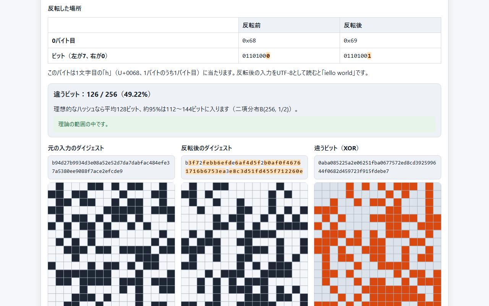
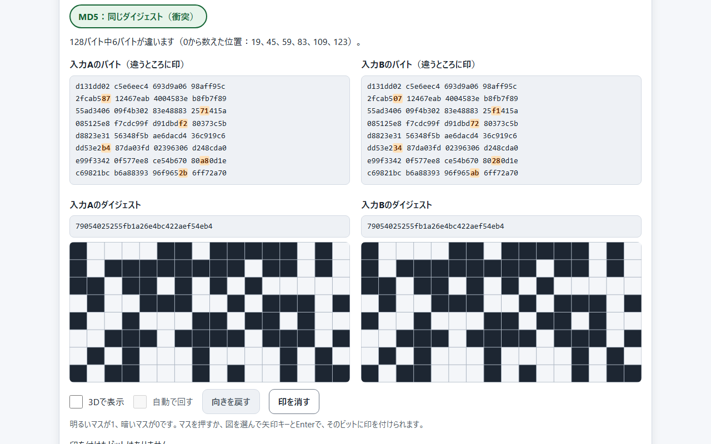
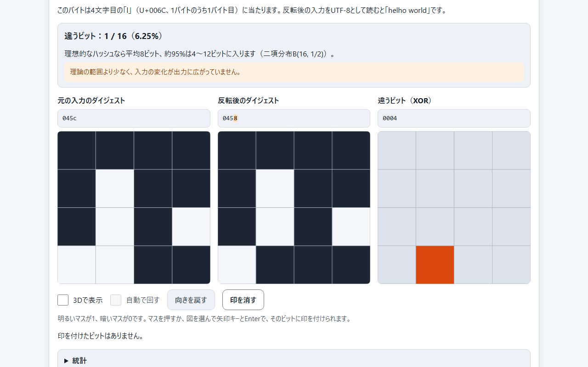
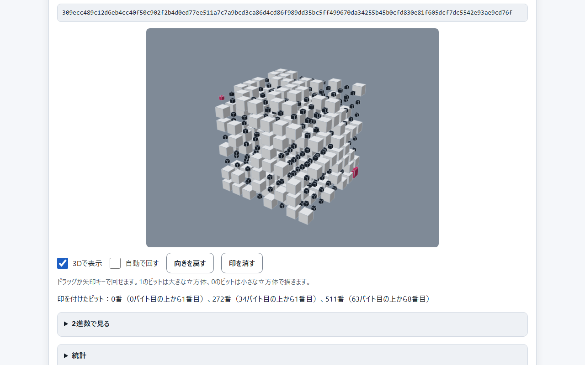
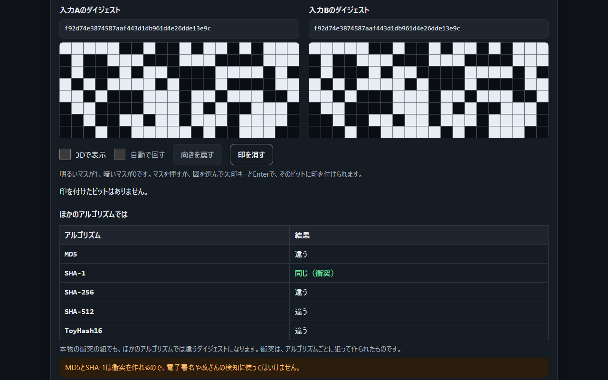

<!--
---
id: day056
slug: hashviz

title: "HashViz"

subtitle_ja: "教育用ハッシュ関数ビジュアライザー"
subtitle_en: "Educational Hash Function Visualizer"

description_ja: "ハッシュ関数のアバランシェ効果と、研究で見つかった本物の衝突を、ビットの絵で確かめる教育用ツール。1ビットの反転で変わるビット数を二項分布の理論の範囲と比べ、MD5（Wangらの2004年の組・1ブロックの組・文字列どうしの組）とSHA-1（SHAtteredの先頭320バイト）の衝突をブラウザーの中で計算して確かめられる。MD5・SHA-1・SHA-256・SHA-512・ToyHash16に対応し、2D/3Dで表示する。ネットワークへは何も送らない。"
description_en: "An educational tool for checking the avalanche effect of hash functions, and real collisions found by researchers, as pictures of bits. Compare the number of bits changed by a single-bit flip with the range expected from the binomial distribution, and compute real MD5 collisions (Wang et al. 2004, a single-block pair, two printable strings) and the SHA-1 collision of SHAttered (its first 320 bytes) right in the browser. Supports MD5, SHA-1, SHA-256, SHA-512 and ToyHash16 in 2D and 3D. Nothing is sent over the network."

category_ja:
  - 現代暗号
  - ハッシュ関数
category_en:
  - Modern Cryptography
  - Hash Function

difficulty: 3

tags:
  - hash
  - visualization
  - collision
  - avalanche
  - cryptography
  - education
  - 3D
  - MD5
  - SHA-1
  - SHA-256

repo_url: "https://github.com/ipusiron/hashviz"
demo_url: "https://ipusiron.github.io/hashviz/"

hub: true
---
-->

# HashViz - 教育用ハッシュ関数ビジュアライザー

[English](README.en.md) · 日本語


[](https://ipusiron.github.io/hashviz/)

**Day056 - 生成AIで作るセキュリティツール100**

HashVizは、ハッシュ関数の性質をビットの絵で確かめる教育用ツールです。入力の1ビットだけを反転し、ダイジェスト（ハッシュ値）のどのビットが変わったかを、マス目と3Dの立方体で見比べます。変わったビットの数は、理想的なハッシュで期待される範囲（二項分布）と比べて示します。

衝突のタブでは、研究で見つかった本物の衝突の組を、このページの中で計算して確かめられます。MD5はWangらが2004年に示した組（128バイト）、1ブロックだけの組（64バイト）、印字できる文字どうしの組（72文字）、SHA-1はSHAtteredの2つのPDFの先頭320バイトです。同じ組をほかのアルゴリズムで計算すると、ダイジェストは別物になります。

暗号やセキュリティを学び始めた学生やエンジニアが、文字や数式だけでは想像しにくいハッシュ関数の性質を、手を動かして確かめることを目的としています。ネットワークへは何も送りません。

---

## 🌐 デモページ

👉 **[https://ipusiron.github.io/hashviz/](https://ipusiron.github.io/hashviz/)**

ブラウザーで直接お試しいただけます。

---

## 📸 スクリーンショット

>
>
>*アバランシェ効果のタブ（SHA-256、hello worldの0バイト目の0ビット目を反転）*

>
>
>*衝突のタブ（Wangらの2004年のMD5の衝突の組）*

>
>
>*弱いハッシュToyHash16では、変わるビットが理論の範囲より少ない*

>
>
>*可視化のタブ（SHA-512の3D表示と、印を付けたビット）*

>
>
>*SHAtteredの先頭320バイトは、SHA-1だけで衝突する（ダークモード）*

---

## ✨ 機能

### アバランシェ

- 入力（テキスト・16進・Base64）の指定したバイトの指定したビットを1つ反転し、元の入力と反転後の入力のダイジェストを並べる
- 反転したバイトの前後の値（16進と2進。反転したビットに印）と、テキストの場合はそのバイトが何文字目の何バイト目かを示す
- 2つのダイジェストの違う桁に印を付け、違うビット（XOR）を3枚目の図に描く
- 違うビットの数と割合を、理想的なハッシュの理論の範囲（二項分布B(n, 1/2)の約95%）と比べる
- 「前のビット」「次のビット」「ランダムな位置」で反転する位置を動かせる
- 範囲外の位置や読めない入力は、丸めずに理由を示す

### 可視化

- ダイジェストを16進と2進で表示し、ビットを上位から順にマス目へ並べる
- マスを押すか、キーボード（矢印キーとEnter）で、そのビットに印を付けられる。印を付けたビットは、何バイト目の上から何番目かを文字でも示す
- 統計（1の数・0と1の偏り・同じビットの連続など）を表で示す

### 衝突

- 本物の衝突の組を6つ収録（MD5が3組、SHA-1が1組、ToyHash16が2組）。それぞれに出典を付ける
- 2つの入力の違うバイトに印を付け、何バイト中何バイトが違うかを示す
- 選んだアルゴリズムで同じダイジェストになるか（衝突か）を判定し、ほかのすべてのアルゴリズムでの結果も表で並べる
- 入力欄は編集できる。1文字でも変えると衝突が崩れることを確かめられる

### 用語集

- ハッシュ関数・ダイジェスト・アバランシェ効果・衝突・衝突耐性・一方向性・第二原像耐性・誕生日攻撃・Merkle–Damgård構造・MD5・SHA-1・SHA-2・SHA-3・Wangらの攻撃・SHAttered・選択プレフィックス衝突・Flame・ToyHash16・ハッシュの可視化の19項目

### 共通

- 2Dのマス目と3Dの立方体を切り替えられる。3Dはドラッグか矢印キーで回し、自動で回すこともできる（タブが隠れているときと3Dを切ったときは止まる）
- アルゴリズムはMD5・SHA-1・SHA-256・SHA-512・ToyHash16
- 日本語と英語の切り替え、ライトとダークの切り替え
- 入力を変えると、すぐに計算し直す

---

## 📖 使い方

### アバランシェのタブ

1. 入力欄に文字列を入れ、入力の形式とアルゴリズムを選びます
2. 反転するバイトの位置（0から数える）とビットの位置（0が最下位、7が最上位）を入れます
3. 反転した場所の表で、どの文字のどのビットが変わったかを確かめます
4. 違うビットの数が理論の範囲に入っているかを確かめます。「次のビット」で位置を動かし、何度か比べてください
5. アルゴリズムをToyHash16に変えると、変わるビットがほとんどないことがわかります

### 可視化のタブ

1. 入力欄に文字列を入れ、アルゴリズムを選びます
2. 入力を1文字変えて、マス目の模様がまったく別のものになることを確かめます
3. 気になるビットに印を付けます。「3Dで表示」を選ぶと立方体で表示します

### 衝突のタブ

1. 衝突の組を選び、「入力欄に入れる」を押します
2. 判定（同じダイジェスト）と、違うバイトの位置を確かめます
3. 「ほかのアルゴリズムでは」の表で、ほかのアルゴリズムでは衝突しないことを確かめます
4. 入力Bを1文字変えて、衝突が崩れることを確かめます

### 用語集のタブ

- ハッシュ関数の性質と、このツールで扱う攻撃の用語を読めます

---

## 🌊 アバランシェ効果

暗号学的ハッシュ関数の重要な性質のひとつに、アバランシェ効果（Avalanche Effect）があります。入力のわずかな変化（たとえば1ビットだけの違い）が、出力全体に大きな変化をもたらす性質です。

理想的なハッシュでは、入力の1ビットを反転すると、出力の各ビットが確率1/2で反転します（厳密なアバランシェ基準、SAC）。このとき、変わるビットの数は二項分布B(n, 1/2)に従います。平均は出力の半分ですが、1回の試行でちょうど50%になることはまれです。**HashVizは、変わったビットの数を、この分布の中央の約95%の範囲と比べて示します。**

| アルゴリズム | 出力のビット数 | 平均 | 標準偏差 | 約95%の範囲 |
|---|---|---|---|---|
| MD5 | 128 | 64 | 5.66 | 53〜75 |
| SHA-1 | 160 | 80 | 6.32 | 68〜92 |
| SHA-256 | 256 | 128 | 8.00 | 112〜144 |
| SHA-512 | 512 | 256 | 11.31 | 234〜278 |
| ToyHash16 | 16 | 8 | 2.00 | 4〜12 |

- 範囲の下の端は「その値以下になる確率が2.5%を超える最小の値」、上の端は左右対称の値である
- 理想的なハッシュでも、20回に1回ほどは範囲の外になる。1回外れただけで弱いとはいえない

`hello world`の0バイト目（`h`、0x68）の0ビット目を反転すると`iello world`になります。このときに変わるビットの数は次のとおりです。

| アルゴリズム | 元の入力のダイジェスト | 変わったビット |
|---|---|---|
| MD5 | `5eb63bbbe01eeed093cb22bb8f5acdc3` | 67 / 128 |
| SHA-1 | `2aae6c35c94fcfb415dbe95f408b9ce91ee846ed` | 88 / 160 |
| SHA-256 | `b94d27b9934d3e08a52e52d7da7dabfac484efe37a5380ee9088f7ace2efcde9` | 126 / 256 |
| ToyHash16 | `045c` | 1 / 16 |

---

## 💥 衝突の組

衝突のタブに収録した組は、論文や配布元のデータそのものです。どの組も、狙ったアルゴリズムだけで同じダイジェストになり、ほかのアルゴリズムでは別物になります（`test/core.test.js`で確かめている）。

| 組 | アルゴリズム | 長さ | 違うバイト | 同じになるダイジェスト | 出典 |
|---|---|---|---|---|---|
| Wangらの衝突 | MD5 | 128バイト | 6 | `79054025255fb1a26e4bc422aef54eb4` | Wang, Feng, Lai, Yu（2004）IACR ePrint 2004/199 |
| 1ブロックだけの衝突 | MD5 | 64バイト | 2 | `008ee33a9d58b51cfeb425b0959121c9` | Stevens（2012）IACR ePrint 2012/040 |
| 文字列どうしの衝突 | MD5 | 72バイト | 1 | `faad49866e9498fc1719f5289e7a0269` | Project HashClash（Stevens、MIT License）、corkami/collisions |
| SHAtteredの先頭320バイト | SHA-1 | 320バイト | 62 | `f92d74e3874587aaf443d1db961d4e26dde13e9c` | Stevensら（2017）IACR ePrint 2017/190 |
| 「AB」と0x83 | ToyHash16 | 2バイトと1バイト | 2 | `0083` | このツールの例 |
| 「ABC」と0xC6 | ToyHash16 | 3バイトと1バイト | 3 | `00c6` | このツールの例 |

- Wangらの組は、MD5の標準の初期値のまま2ブロック（128バイト）で衝突する。当時は1時間ほどかかったが、2006年の改良で一般的なPCでも1分ほどになり、今は数秒で同じ種類の組を作れる
- 1ブロックだけの組は、2010年にXieとFengが最初の例を示し、2012年にStevensが別の方法で作った（MD5の圧縮関数を約2^49.8回）
- 文字列どうしの組は、22文字目の`A`と`E`だけが違う。最後のパディングまで含めて衝突しているので、後ろに同じ文字列を足すと崩れる
- SHAtteredは、2017年にGoogleとCWIが公表したSHA-1の最初の衝突で、SHA-1を約2^63回（約922京回）計算した（CPUで6,500年分、GPUで110年分）。2つのPDFは192バイトまで同じで、そのあとの128バイトの中の62バイトが違う。先頭320バイトの後ろに同じ内容を足しても衝突は保たれる

MD5とSHA-1は、ブロックごとに内部状態を更新するMerkle–Damgård構造です。2つの入力が同じ長さで、ブロックの区切りで内部状態がそろっていれば、後ろに同じデータを足しても衝突は保たれます。**MD5とSHA-1は衝突を作れるので、電子署名や改ざんの検知に使ってはいけません。**

---

## 🔍 可視化のしくみ

1. 入力をバイト列にし（テキストはUTF-8）、選んだアルゴリズムでダイジェストを計算する
2. ダイジェストの各バイトを上位ビットから8ビットに分け、全体でnビットの並びにする（ビット番号iは、i÷8バイト目の上から(i mod 8)+1番目）
3. ビットを左から右へ、行が終われば下の行へ並べる。1は明るいマス、0は暗いマスで塗る
4. 3Dでは、同じ順で1層を埋め、層が終われば奥の層へ進む。1は大きな立方体、0は小さな立方体で描き、中まで見通せるようにする

| アルゴリズム | ビット数 | 2Dのマス目（列×行） | 3Dの立方体（列×行×層） |
|---|---|---|---|
| MD5 | 128 | 16×8 | 8×4×4 |
| SHA-1 | 160 | 20×8 | 8×5×4 |
| SHA-256 | 256 | 16×16 | 8×8×4 |
| SHA-512 | 512 | 32×16 | 8×8×8 |
| ToyHash16 | 16 | 4×4 | 4×2×2 |

- 3Dの絵は、ビットの並びを立体に置いたもので、ハッシュ関数の内部の構造を表すものではない
- 3Dは、立方体を奥から順に塗る方法（画家のアルゴリズム）で、Canvasに直接描く

---

## 🎮 ToyHash16

ToyHash16は、このツールのための教育用の弱いハッシュです。入力バイト列の総和を65536で割った余りを、2バイト（上位・下位）のハッシュ値として返します。

$$\text{ToyHash16}(m) = \left( \sum_{i=0}^{|m|-1} m_i \right) \bmod 2^{16}$$

- $m$は入力バイト列、$m_i$は位置$i$のバイト値（0〜255）、$|m|$はバイト列の長さ

実際の暗号学的ハッシュ関数とは違い、非常に弱い設計ですが、衝突を簡単に確かめられる教材として役立ちます。

- 入力A`"AB"`（16進で`41 42`）は0x41＋0x42＝131で`0x0083`
- 入力B`"\x83"`（16進で`83`）は131で`0x0083`

どちらもハッシュ値は`0x0083`になり、衝突が起きます。足し算の順番を変えても和は同じなので、バイトを並べ替えるだけでも衝突します。

ToyHash16では、入力の1ビットを反転しても、和が1つの2のべき乗だけ変わるので、出力のビットは1つか、繰り上がりのぶんの数ビットしか変わりません。`hello world`の3バイト目の2ビット目を反転すると、ダイジェストは`045c`から`0458`になり、変わるのは16ビット中1ビットです。理論の範囲（4〜12ビット）を大きく下回ります。

### 確かめ方

1. 衝突のタブで、衝突の組から「ToyHash16：「AB」と0x83」を選び、「入力欄に入れる」を押します
2. 判定が「同じダイジェスト（衝突）」になることを確かめます
3. アバランシェのタブでアルゴリズムをToyHash16にし、SHA-256と比べます

---

## 🎓 学習の進め方

本ツールは、暗号学的ハッシュ関数の学習を段階的に進められるよう設計されています。次の流れで体験すると、基礎から応用まで理解を深められます。

### Step 1: ハッシュ値の観察

- 任意の文字列を入力し、SHA-256などでハッシュ化する
- 16進のダイジェストとマス目の模様を確認する
- 目的：ハッシュ値が「入力の指紋」であることを直感的に理解する

### Step 2: アバランシェ効果の体験

- 入力の1ビットだけを反転させ、ハッシュを再計算する
- 変わったビットの数を、理論の範囲（二項分布）と比べる
- 目的：ハッシュ関数の「予測困難さ」と「強い拡散性」を体験する

### Step 3: 弱いハッシュ（ToyHash16）との比較

- ToyHash16で同じ操作をし、変わるビットがほとんどないことを確かめる
- 既知の衝突の組（`"AB"`と`"\x83"`）を確かめる
- 目的：良いハッシュに求められる性質を、弱いハッシュとの対比で理解する

### Step 4: 実世界の衝突（MD5 / SHA-1）

- 研究で見つかった本物の衝突の組を計算して確かめる
- 同じ組がSHA-256では衝突しないことを確かめる
- 目的：かつて安全と考えられていたアルゴリズムが破られたことと、暗号アルゴリズムの寿命を学ぶ

### Step 5: 現代のハッシュへの移行

- SHA-256・SHA-512を使い、用語集でSHA-1の扱いの移り変わり（認証局の発行停止、ブラウザーの不信頼化、NISTの方針）を読む
- 目的：強いアルゴリズムを選ぶ必然性を、自分で納得する

---

## 🎯 ユースケース

### 授業・学習

- 大学や専門学校の授業で、学生が自分の名前を入力し、1ビットの反転で変わるビットの数が理論の範囲に入るかを確かめる。SHA-256とToyHash16を並べて、「良いハッシュとは何か」を話し合うきっかけになる
- 情報処理安全確保支援士などの試験勉強で、一方向性・第二原像耐性・衝突耐性の違いを、用語集と衝突のタブで確かめる。衝突の組を見てから「衝突耐性が破られる」の意味を読むと、言葉だけで覚えるより定着しやすい
- 教員が、Wangらの組やSHAtteredの組を画面に映し、「同じダイジェストなのにデータは違う」ことを授業で実演する

### 仕事

- 開発者が、ファイルの同一性の確認にMD5を使っている既存の仕組みを見直すとき、衝突の組の画面を説明資料に使う。攻撃者がファイルを用意できる場面では、MD5が同じでも同じファイルとはいえないことを示せる
- 情報システムや監査の担当者が、社内の規程で「SHA-1の署名・証明書を使わない」理由を説明するとき、SHAtteredの320バイトで実際に衝突することを見せる
- ストレージやバックアップの担当者が、ハッシュによる重複排除の前提（衝突が起きないこと）が、MD5やSHA-1では攻撃者に崩されうることを確かめる

### 暮らし・家庭

- ダウンロードしたソフトウェアの配布ページにある「SHA-256」の値が何を意味するかを、1文字変えるとまったく別の値になることで確かめる（このツールはファイルを読めないので、ファイルのハッシュはOSのコマンドなどで計算する）
- 家族や友人に「パスワードやデータの指紋」の考え方を説明するとき、模様が変わる様子を見せる

### 趣味・創作

- 謎解きやパズルとして、ToyHash16の衝突を手で探す。バイトの和だけで決まるので、並べ替えや足し算で衝突を作れる
- ダイジェストのマス目を、ドット絵・刺しゅう・ビーズの図案の元にする。入力を変えると、別の模様が得られる
- 3Dの自動回転を、勉強会やイベントのブースの展示に使う

### 研究・調べもの

- 論文で読んだ衝突の組の16進をそのまま貼り付け、本当に衝突するかをブラウザーの中で確かめる
- アバランシェの結果を何カ所かで集め、二項分布の範囲にどのくらい入るかを記録する

### CTF

- 「同じMD5なのに中身が違う」系の問題を解く前に、衝突の組の性質（同じ長さ、違うバイトの位置、後ろに足したときの振る舞い）を確かめる
- 作問者が、ToyHash16で手計算できる衝突の問題を作る

### ほかのツールとの組み合わせ

- [Hash Identifier](https://ipusiron.github.io/hash-detector/)でハッシュ値の長さからアルゴリズムを推定し、HashVizで同じ長さのダイジェストを作って見比べる
- 関連本（下の「参考」）でハッシュ関数の章を読みながら、性質を1つずつ画面で確かめる

---

## 🔬 技術的な説明

### ハッシュの計算

- MD5：RFC 1321を自前で実装している（`js/hashviz-core.js`）。ブロックごとの内部状態も返せる。RFC 1321の付録A.5のテストスイートと、Node.jsの`crypto`の値でテストしている
- SHA-1・SHA-256・SHA-512：ブラウザーのWeb Crypto（`crypto.subtle.digest`）で計算する
- ToyHash16：バイトの和を65536で割った余りを2バイトで返す

### 入力の形式

- テキスト：UTF-8に直したバイト列（日本語の1文字は3バイト）
- 16進：空白と改行は無視し、先頭の`0x`を1つだけ外す。奇数桁と16進でない文字は理由を示す
- Base64：標準（`+` `/`）とURL用（`-` `_`）を受け付け、末尾の`=`は省いてもよい
- 上限は1回の入力あたり400,000バイト（アバランシェと可視化の入力欄は10,000文字、衝突の入力欄は100,000文字まで）

### 統計の意味

- 統計の表（1の数・0と1の偏り〔エントロピー〕・同じビットの連続・異なるバイト値の数）は、1つのダイジェストの0と1の並びを数えたもので、ハッシュの強さを示す数ではない

### 描画

- 2Dのマス目と3Dの立方体は、どちらもCanvasに描く。図の大きさは表示の幅に合わせ、高解像度の画面では`devicePixelRatio`倍で描く
- 3Dの自動回転は、3D表示・自動回転の指定・タブが見えている・ページが見えている、がそろったときだけ動く

---

## 🔒 セキュリティ

- 入力はどこにも送らない。meta CSPで`connect-src 'none'`とし、外部のスクリプト（CDN）を読まない
- スクリプトとスタイルは同じ場所のファイルだけ（`script-src 'self'`・`style-src 'self'`）。HTMLにインラインのスクリプト・style属性・イベントハンドラーはない
- 画面の動的な部分は`textContent`と要素の組み立てで作る（`innerHTML`を使わない）
- `localStorage`には言語とテーマの選択だけを保存する。使えない環境でも動く

---

## ⚠️ 注意と限界

- このツールはファイルを読めない。入力欄にテキスト・16進・Base64を貼り付ける
- SHA-3やBLAKE2などは扱わない（ブラウザーのWeb Cryptoで計算できないため）
- 衝突のタブは、研究で見つかった組を計算して確かめるもので、新しい衝突を作る機能はない
- 理論の範囲（約95%）は統計の目安で、1回の試行で外れても、そのハッシュが弱いとは限らない
- 3Dの絵は、ビットの並びを立体に置いたもので、ハッシュ関数の内部の構造を表すものではない
- 本ツールは暗号の学習・教育を目的としている。作者は、人を害する使い方を勧めません

---

## 📝 開発経緯と実装メモ

### Claude Codeの実行時のエラー

本ツールの「衝突デモ」タブを実装する際、Claude Codeに対して「ハッシュ衝突タブを完成させて。dataフォルダー内のサンプルが足りなければ追加して」というリクエストを行ったところ、以下のエラーが発生しました。

```
API Error: Claude's response exceeded the 32000 output token maximum.
To configure this behavior, set the CLAUDE_CODE_MAX_OUTPUT_TOKENS environment variable.
```

これは、Claude Codeの出力が32,000トークンの上限を超えたために発生するエラーです。衝突のファイル（SHAtteredのPDFは1つ約422KB）をそのまま展開しようとしたことが原因でした。

### 教訓

- Claude Codeに大規模データを直接生成させようとすると、出力が肥大化して上限を超えることがある
- 大きなデータは、必要な部分だけを持つ。衝突は先頭の数十〜数百バイト（MD5は64〜128バイト、SHA-1は320バイト）で成り立つので、HashVizはその部分だけを計算部に持っている
- 実装依頼は「小さく区切って段階的に」行うと安定する

この経緯を踏まえ、本ツールではまずToyHash16の衝突デモを完成させ、後からMD5・SHA-1の実例を追加するという段階的なアプローチを採用しました。

---

## 🧪 テスト

```bash
npm test
```

- Node.js 22以上の`node --test`で動き、依存パッケージはない（`npm install`は不要）
- GitHub Actionsで、pushとpull requestのたびに実行する
- `test/core.test.js`：MD5（RFC 1321のテストスイート、0x80以上のバイトを含む入力をNode.jsの`crypto`と比較）、SHA系、ToyHash16、衝突の組（狙ったアルゴリズムだけで衝突すること、違うバイトの位置）、入力の読み取り、1ビットの反転、二項分布の範囲（BigIntの厳密な計算と比較）、統計、グリッドと3Dの配置・投影
- `test/html.test.js`・`test/contrast.test.js`・`test/messages.test.js`・`test/i18n.test.js`・`test/format.test.js`：CSP、外部のスクリプトがないこと、タブのARIA、辞書と画面の文言、配色のコントラスト（4.5:1・3:1）、書式
- `test/readme.test.js`：READMEの表（理論の範囲・例・衝突の組・マス目の形）を計算部の出力と比べ、日英のREADMEの見出し・画像・ディレクトリー構造を確かめる

---

## 🔗 参考

### 一次資料

- [R. Rivest「RFC 1321: The MD5 Message-Digest Algorithm」（1992年）](https://www.rfc-editor.org/rfc/rfc1321)
- [X. Wang, D. Feng, X. Lai, H. Yu「Collisions for Hash Functions MD4, MD5, HAVAL-128 and RIPEMD」（IACR ePrint 2004/199）](https://eprint.iacr.org/2004/199)
- [M. Stevens「Single-block collision attack on MD5」（IACR ePrint 2012/040）](https://eprint.iacr.org/2012/040)
- [M. Stevens「MD5 single-block collision」（message1.bin・message2.bin）](https://marc-stevens.nl/research/md5-1block-collision/)
- [M. Stevens, E. Bursztein, P. Karpman, A. Albertini, Y. Markov「The first collision for full SHA-1」（IACR ePrint 2017/190）](https://eprint.iacr.org/2017/190)
- [Google Security Blog「Announcing the first SHA1 collision」（2017年2月23日）](https://security.googleblog.com/2017/02/announcing-first-sha1-collision.html)
- [G. Leurent, T. Peyrin「SHA-1 is a Shambles」（IACR ePrint 2020/014）](https://eprint.iacr.org/2020/014)
- [Project HashClash（M. Stevens）](https://github.com/cr-marcstevens/hashclash)
- [corkami「collisions」（A. Albertini）](https://github.com/corkami/collisions)
- [NIST「NIST Retires SHA-1 Cryptographic Algorithm」（2022年12月15日）](https://www.nist.gov/news-events/news/2022/12/nist-retires-sha-1-cryptographic-algorithm)
- [NIST「FIPS 202: SHA-3 Standard」](https://csrc.nist.gov/pubs/fips/202/final)
- [A. Perrig, D. Song「Hash Visualization: a New Technique to improve Real-World Security」（1999年）](https://users.ece.cmu.edu/~adrian/projects/validation/validation.pdf)

### 関連本（関わった書籍から）

- [『暗号技術のすべて』](https://akademeia.info/?page_id=157)（翔泳社刊）…第5章「ハッシュ関数」
- [『安全な暗号をどう実装するか 暗号技術の新設計思想』](https://book.mynavi.jp/ec/products/detail/id=147364)（マイナビ刊）…第6章「ハッシュ関数」

### 関連ツール（自作）

- [Token Entropy Estimator - エントロピー測定によるトークン強度チェッカー](https://ipusiron.github.io/token-entropy-estimator/)
- [Hash Identifier - ハッシュ識別ツール](https://ipusiron.github.io/hash-detector/)

---

## 📁 ディレクトリー構造

```text
hashviz/
├── .github/                 # GitHubの設定
│   └── workflows/           # GitHub Actionsのワークフロー
│       └── test.yml         # pushとpull requestでnpm testを実行
├── assets/                  # README用の画像
│   ├── en/                  # 英語の画面のスクリーンショット
│   │   ├── screenshot.png   # アバランシェのタブ（英語）
│   │   ├── screenshot2.png  # Wangらの衝突の組（英語）
│   │   ├── screenshot3.png  # ToyHash16のアバランシェ（英語）
│   │   ├── screenshot4.png  # SHA-512の3D表示（英語）
│   │   └── screenshot5.png  # SHAtteredの衝突（英語・ダーク）
│   ├── screenshot.png       # アバランシェのタブ
│   ├── screenshot2.png      # Wangらの衝突の組
│   ├── screenshot3.png      # ToyHash16のアバランシェ
│   ├── screenshot4.png      # SHA-512の3D表示
│   └── screenshot5.png      # SHAtteredの衝突（ダーク）
├── js/                      # 画面が読むスクリプト
│   ├── app.js               # 画面の処理（タブ・入力・結果の表示）
│   ├── draw.js              # Canvasへの描画（2Dのマス目と3Dの立方体）
│   ├── hashviz-core.js      # 計算部（MD5・SHA系・ToyHash16、衝突の組、理論の範囲、3Dの配置）
│   ├── i18n.js              # 言語の選択と、HTMLの文言の差し替え
│   ├── messages.js          # 日本語・英語の文言
│   ├── theme-init.js        # 描画の前に保存したテーマを当てる
│   └── theme.js             # ライト・ダークの切り替え
├── test/                    # 自動テスト（node --test）
│   ├── contrast.test.js     # 配色のコントラストと操作要素の大きさ
│   ├── core.test.js         # 計算部
│   ├── format.test.js       # 行の長さ・改行・制御文字
│   ├── html.test.js         # CSP・タブのARIA・文言とHTMLの一致
│   ├── i18n.test.js         # 言語の決め方
│   ├── load.js              # 画面と同じスクリプトをテストに読み込む
│   ├── messages.test.js     # 日英の辞書
│   └── readme.test.js       # READMEの表・見出し・画像・ディレクトリー構造
├── .gitignore               # Gitの管理から外すファイル
├── .nojekyll                # GitHub PagesでJekyllを使わない
├── CLAUDE.md                # 開発のための説明（Claude Code用）
├── LICENSE                  # MITライセンス
├── README.en.md             # 英語のREADME
├── README.md                # このファイル
├── index.html               # 画面
├── package.json             # npm testの定義（依存パッケージなし）
└── style.css                # スタイル（ライト・ダーク）
```

---

## 💻 動作環境

- 最近のブラウザー（Chromium・Edge・Firefoxで動作を確かめている。Safariは未確認）
- `index.html`をブラウザーで直接開いても動く。ローカルのHTTPサーバーで開く場合は、次のとおり

```bash
python -m http.server 8000
# http://localhost:8000/ を開く
```

---

## 📄 ライセンス

MIT License - 詳細は [LICENSE](LICENSE) をご覧ください。

---

## 🛠️ このツールについて

本ツールは、「生成AIで作るセキュリティツール100」プロジェクトの一環として開発されました。
このプロジェクトでは、AIの支援を活用しながら、セキュリティに関連するさまざまなツールを100日間にわたり制作・公開していく取り組みを行っています。

プロジェクトの詳細や他のツールについては、以下のページをご覧ください。

🔗 [https://akademeia.info/?page_id=42163](https://akademeia.info/?page_id=42163)
